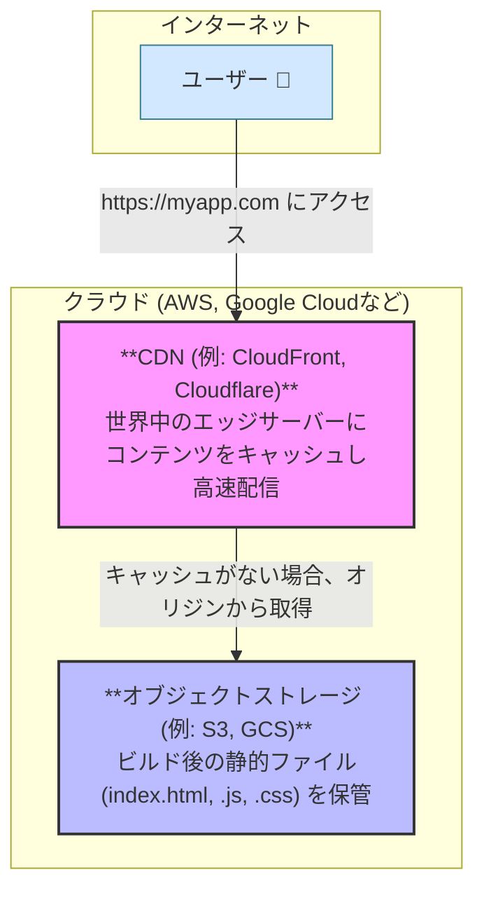
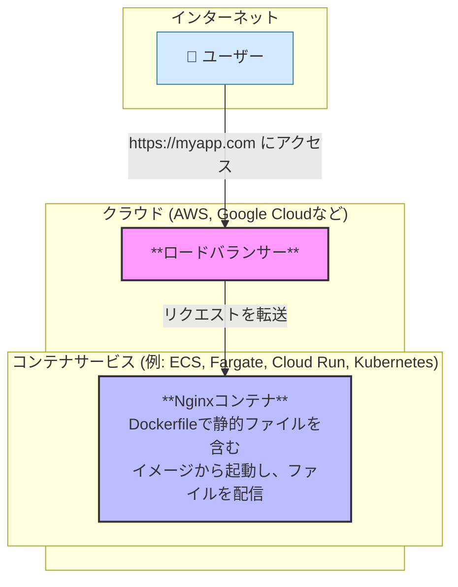
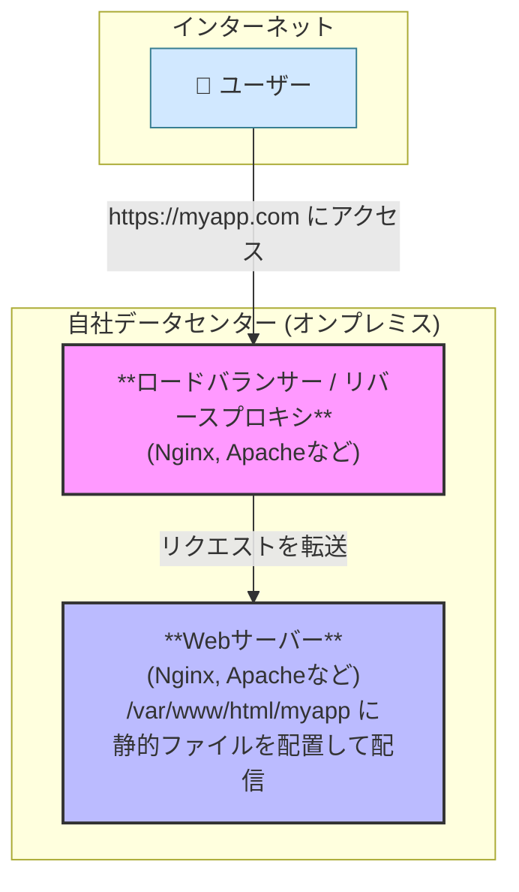

# デプロイ周り

## 前提：Angular アプリケーションのビルド

まず、デプロイの前に何が行われるかを理解することが重要です。開発が完了したら、以下のコマンドを実行します。

**`ng build`**

(本番環境向けには `ng build --configuration production` が使われ、最適化が強化されます)

このコマンドは、frontend ディレクトリ内に `dist/` というディレクトリを生成します。この中には、ブラウザが直接解釈できる、最適化（圧縮、不要なコードの削除など）された静的なファイル群（HTML, CSS, JavaScript）が格納されています。

ここでの最重要ポイントは、「デプロイする成果物は、単なる静的ファイルの集まりである」ということです。 React も同様です。この性質が、デプロイアーキテクチャの選択肢を広げています。

---

## 1. クラウド環境でのデプロイアーキテクチャ

クラウド（AWS, Google Cloud, Azure など）では、この「静的ファイル」という特性を活かした、モダンで効率的な方法が主流です。

**A) 最も一般的：静的サイトホスティング + CDN**

これは現在、最も推奨される構成です。

- アーキテクチャ図:



1 [ユーザー] <--> [CDN (CloudFront, Cloudflare)] <--> [オブジェクトストレージ (S3, GCS)]
2 (ここにビルド後の静的ファイル)

- 仕組み:

  1.  `ng build` で生成された `dist/` 内のファイルを、AWS S3 や Google CloudStorage などの安価なオブジェクトストレージにアップロードします。
  2.  Amazon CloudFront や Cloudflare といった CDN（コンテンツデリバリネットワーク）を設定し、オリジン（配信元）をそのオブジェクトストレージに向けます。
  3.  ユーザーは CDN のエンドポイント（例: `https://myapp.com`）にアクセスします。CDN は世界中のエッジサーバーにファイルのコピーをキャッシュ（一時保存）するため、ユーザーに最も近い場所から超高速でファイルを配信できます。

- メリット:
  - 高速: CDN により、ユーザーは地理的に最も近いサーバーからコンテンツを取得できます。
  - 高可用性とスケーラビリティ: ストレージと CDN は非常に堅牢で、トラフィックの急増にも自動で対応します。サーバーの管理が不要です。
  - 低コスト:
    サーバーを常時稼働させる必要がなく、データ転送量に応じた従量課金であるため、非常に安価です。
  - 高セキュリティ:
    静的ファイルのみなので、サーバーサイドの脆弱性を突く攻撃のリスクが大幅に低減します。

**B) コンテナを利用したデプロイ**

- アーキテクチャ図:



1 [ユーザー] <--> [ロードバランサー] <--> [コンテナサービス (ECS, Fargate, Cloud Run, Kubernetes)]
2 (Nginx コンテナが静的ファイルを配信)

- 仕組み:

  1.  ng build で静的ファイルを生成し、それを Nginx（軽量な Web サーバー）が入った Docker イメージにコピーする Dockerfile を作成します。
  2.  この Docker イメージをコンテナレジストリ（ECR, GCR）にプッシュします。
  3.  AWS Fargate, Google Cloud Run, Azure Container Apps のようなサーバーレスコンテナサービスや、Kubernetes (EKS, GKE) を使ってコンテナをデプロイします。

- メリット:

  - 環境のポータビリティ: フロントエンドと、それを配信する Web サーバー（Nginx）をセットでパッケージ化できるため、環境依存の問題が起きにくいです。
  - 統合管理: バックエンドもコンテナで動いている場合、同じコンテナオーケストレーションツール（Kubernetes など）で統一的に管理できます。

- デメリット:
  - 静的サイトホスティングに比べ、構成が複雑でコストも高くなる傾向があります。

---

## 2. オンプレミス環境でのデプロイアーキテクチャ

自社で管理するサーバーにデプロイする場合です。

**A) 最も一般的：Web サーバーによる配信**

- アーキテクチャ図:



1 [ユーザー] <--> [ロードバランサー/リバースプロキシ (Nginx, Apache)] <--> [Web サーバー(Nginx, Apache)]
2 (サーバーの特定のディレクトリに静的ファイル)

- 仕組み:

  1.  オンプレミスの Web サーバー（Linux マシンなど）を用意します。
  2.  ng build で生成された dist/ 内のファイルを、サーバーの公開ディレクトリ（例: `/var/www/html/todo-app`）にコピーします（scp や rsync コマンド、または CI/CD ツールを使用）。
  3.  Nginx や Apache といった Web サーバーソフトウェアを設定し、そのディレクトリをルートとして静的ファイルを配信するようにします。

- 重要な設定：SPA のルーティング対応
  Angular のような SPA では、`https://myapp.com/todos/1` のような URL に直接アクセス（またはリロード）すると、サーバーは `todos/1` というファイルやディレクトリを探しに行き、「404 Not Found」エラーを返してしまいます。これを避けるため、「リクエストされたパスにファイルが存在しない場合は、代わりに `index.html` を返す」という設定が必須です。

Nginx での設定例 (`nginx.conf`):

```conf
server {
  listen 80;
  server_name myapp.com;
  root /var/www/html/todo-app; # ビルドしたファイルを置いた場所

  location / {
    # 最初に URI に一致するファイルを探し、次にディレクトリを探し、
    # どちらもなければ index.html を返す
    try_files $uri $uri/ /index.html;
  }
}
```

- メリット:

  - 伝統的で実績のある構成。多くのエンジニアが慣れています。
  - インフラを完全に自社でコントロールできます。

- デメリット:
  - サーバーの構築、OS のパッチ適用、セキュリティ対策、スケーリングなどをすべて自前で行う必要があり、運用負荷が高いです。

**B) コンテナを利用したデプロイ**

クラウドと同様に、オンプレミスでも Docker と Kubernetes (または OpenShift など)を使ってコンテナを管理する構成も増えています。基本的な考え方はクラウドのコンテナ構成と同じですが、Kubernetes クラスタ自体の管理も自社で行う必要があります。

まとめ

| 観点             | クラウド (静的ホスティング)       | クラウド (コンテナ)                    | オンプレミス (Web サーバー)                      |
| :--------------- | :-------------------------------- | :------------------------------------- | :----------------------------------------------- |
| コスト           | 非常に安い                        | やや高い                               | 高い（ハードウェア＋人件費）                     |
| スケーラビリティ | 非常に高い（自動）                | 高い（設定が必要）                     | 限定的（手動での対応）                           |
| 運用負荷         | ほぼゼロ                          | 低い〜中程度                           | 非常に高い                                       |
| パフォーマンス   | 非常に高い (CDN)                  | 高い                                   | ネットワーク構成に依存                           |
| おすすめのケース | ほとんどの新規 Web フロントエンド | バックエンドとインフラを統一したい場合 | 厳しいセキュリティ要件や既存資産の都合がある場合 |

結論として、特別な理由がない限り、Angular アプリケーションのデプロイには「クラウドの静的サイトホスティング + CDN」の構成が、コスト、パフォーマンス、運用のすべての面で最適です。
