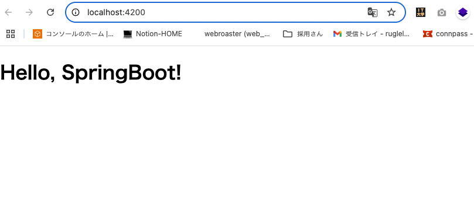
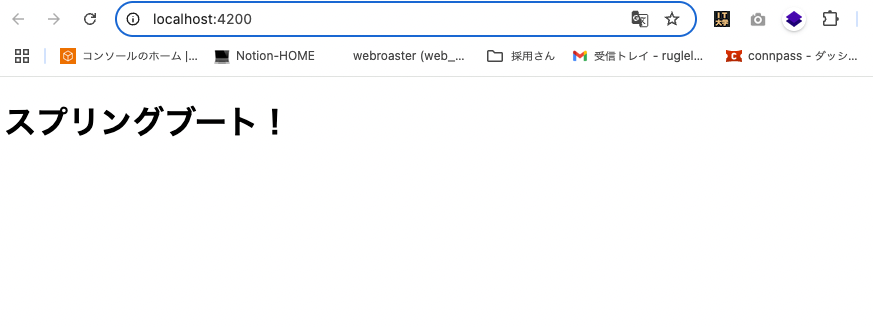

# Lesson 2: フロントエンドとバックエンドの連携 まとめ

このレッスンでは、Angular のフロントエンドから SpringBoot のバックエンド API を呼び出し、その結果を画面に表示しました。これにより、モダンな Web アプリケーションにおける基本的なクライアント-サーバー間の通信方法を学びました。

## 学習目標

- Frontend: Angular の HttpClient を使い、バックエンドの/api/hello エンドポイントにリクエストを送信する。
- Backend: フロントエンドからのリクエストを受け付け、メッセージを返す（Lesson 1 の API をそのまま利用）。
- Goal: フロントエンドの画面に、バックエンドから取得した「Hello, SpringBoot!」というメッセージを表示させる。

## Backend (SpringBoot)

今回は Lesson 1 で作成した API をそのまま利用しました。学習の上で重要なのは、フロントエンドからのリクエストを受け付けるために、アプリケーションを起動しておく必要があるという点です。

### 実行したコマンド:

```sh
# backend ディレクトリで実行
./mvnw spring-boot:run
```

このコマンドにより、組み込みの Web サーバー（Tomcat）が起動し、API が http://localhost:8080 で待ち受け状態になります。

---

## Frontend (Angular)

フロントエンド側では、API 通信に関わる多くの新しい概念が登場しました。

**キーポイント:**

- `HttpClientModule` (`provideHttpClient`): Angular アプリケーション内で HTTP 通信を行うためのサービス群を提供します。app.config.ts に登録することで、アプリ全体で利用可能になります。
- Service (`@Injectable`): コンポーネントから、特定の機能（今回は API 通信）を分離するための仕組みです。@Injec table デコレータを付けることで、他のコンポーネントやサービスに「注入（Inject）」できるようになります。これにより、コードの再利用性とテストのしやすさが向上します。
- `HttpClient`: 実際に HTTP リクエスト（GET, POST など）を行うための中心的なクラスです。Service に注入して使用します。
- `Observable` (RxJS): HttpClient のメソッドは Observable を返します。これは非同期的なデータの流れ（ストリーム）を表現するオブジェクトです。リクエストを送信しても、すぐに結果が返ってくるわけではないため、このような仕組みが使われます。
- `.subscribe()`: Observable の処理を開始し、データが返ってきたタイミングで特定のアクション（コールバック関数）を実行するためのメソッドです。
- `ngOnInit`: コンポーネントの「ライフサイクルメソッド」の一つ。コンポーネントが初期化された直後に一度だけ呼び出されます。データの初期取得など、最初のセットアップ処理を行うのに最適な場所です。
- Proxy (`proxy.conf.json`): 開発時に、Angular の開発サーバー（例: localhost:4200）からバックエンド API（localhost:8080）へリクエストを送る際に発生する CORS（Cross-Origin Resource Sharing）エラーを回避するための設定です。/api で始まるリクエストを、自動的に http://localhost:8080 へ転送するように Angular の開発サーバーに指示します。
- テスト (`HttpClientTestingModule`): HttpClient を利用するサービステストのためのモジュールです。HttpTestingC ontroller を使い、実際の HTTP 通信を行わずにリクエストを模倣（モック）し、期待通りのリクエストが送信されたか、偽のレスポンスを返す、といった制御ができます。
- サービスのモック化: コンポーネントのテストでは、依存するサービス（HelloService）そのものをテストするのではなく、サービスが期待通りに動くという前提で、コンポーネントの振る舞いをテストします。そのために、偽の（モック）サービスを用意して、テストをシンプルかつ高速に保ちます。

関連ファイル:

- frontend/src/app/hello.service.ts （API 通信を担う新しいサービス）
- frontend/src/app/app.component.ts （サービスを呼び出し、結果をプロパティにセットする）
- frontend/src/app/app.config.ts （provideHttpClient を追加）
- frontend/proxy.conf.json （CORS エラー回避のためのプロキシ設定）
- frontend/angular.json （プロキシ設定を有効化）
- frontend/src/app/hello.service.spec.ts （サービステスト）
- frontend/src/app/app.component.spec.ts （コンポーネントテスト）

実行したコマンド:

```sh
# frontend ディレクトリで実行
# ユニットテストの実行
npm test

npm start # 開発サーバーの起動
```

結果

```sh
❯ npm run test

> frontend@0.0.0 test
> ng test

✔ Browser application bundle generation complete.
⠙ Generating browser application bundles (phase: building)...01 07 2025 10:55:18.884:WARN [karma]: No captured browser, open http://localhost:9876/
01 07 2025 10:55:18.897:INFO [karma-server]: Karma v6.4.4 server started at http://localhost:9876/
01 07 2025 10:55:18.897:INFO [launcher]: Launching browsers Chrome with concurrency unlimited
01 07 2025 10:55:18.899:INFO [launcher]: Starting browser Chrome
✔ Browser application bundle generation complete.
✔ Browser application bundle generation complete.
01 07 2025 10:55:20.328:INFO [Chrome 138.0.0.0 (Mac OS 10.15.7)]: Connected on socket k1gpYZK33kvlZSrYAAAB with id 49243313
Chrome 138.0.0.0 (Mac OS 10.15.7): Executed 5 of 5 SUCCESS (0.043 secs / 0.03 secs)
TOTAL: 5 SUCCESS
```

画面の結果



API のレスポンス文字を変えて、画面も変わることを確認


