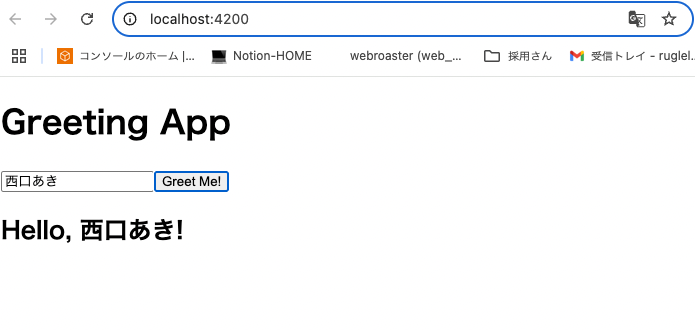

# Lesson 3: データの送信と表示 まとめ

このレッスンでは、フロントエンドのフォームから入力されたデータをバックエンドに送信し、バックエンドがそのデ ータを使って処理を行い、結果をフロントエンドに返して表示する、という一連の流れを実装しました。これにより、 双方向のデータ通信を伴う、よりインタラクティブな Web アプリケーションの作り方を学びました。

## 学習目標

- Frontend: ユーザーが名前を入力し、ボタンをクリックすると、その名前をバックエンドの API に送信する。
- Backend: フロントエンドから POST リクエストで送信された名前（JSON 形式）を受け取り、その名前を含んだ挨拶文（J SON 形式）を返す。
- Goal: フロントエンドの画面に、入力した名前に応じた挨拶メッセージを動的に表示させる。

## Backend (SpringBoot)

キーポイント:

- `@PostMapping("/api/greet")`: HTTP の POST リクエストを、指定されたパス (/api/greet) にマッピングします。データの作成や送信に使われるメソッドです。
- `@RequestBody`: リクエストのボディに含まれる JSON データを、指定した Java のオブジェクト（今回は GreetRequest クラス）に自動的に変換（デシリアライズ）してくれます。
- DTO (Data Transfer Object): GreetRequest や GreetResponse のように、層の間（今回はクライアントとサーバー間）でデータをやり取りするためだけに定義されたクラスです。これにより、やり取りするデータの構造が明確になります。今回はコントローラーのインナークラスとしてシンプルに定義しました。
- JSON のシリアライズ/デシリアライズ: SpringBoot は内部で Jackson というライブラリを使っており、Java オブジェクトと JSON 文字列の相互変換を自動的に行ってくれます。
- テスト (`jsonPath`): MockMvc のテストにおいて、レスポンスが JSON 形式の場合、jsonPath を使って特定のフィールド（例: $.message）の値が期待通りか検証できます。

関連ファイル:

- backend/src/main/java/com/example/demo/Lesson3Controller.java （実装したコード）
- backend/src/test/java/com/example/demo/Lesson3ControllerTest.java （実行したテストコード）

---

## Frontend (Angular)

キーポイント:

- `FormsModule` (`[(ngModel)]`) と テンプレート参照変数 (`#nameInput`):
  - 今回はよりシンプルなテンプレート参照変数 (`#nameInput`) を使いました。HTML 要素に名前をつけ、TypeScript コードからその要素のプロパティ（例: nameInput.value）を直接参照する方法です。
  - もう一つの一般的な方法として、FormsModule をインポートし、[(ngModel)]（双方向バインディング）を使う方法もあります。こちらはフォームが複雑になるにつれて強力になります。
- イベントバインディング (`(click)="greet(nameInput.value)"`): クリックのようなユーザーのアクション（イベント）を、コンポーネントのメソッドに結びつけます。今回は、クリックイベントで greet メソッドを呼び出し、入力値を引数として渡しています。
- `http.post<T>(url, body)`: HttpClient を使い、指定した URL に POST リクエストを送信します。第二引数にリクエストボディとして送信したいオブジェクトを渡します。<T>（ジェネリクス）でレスポンスの型を指定すると、受け取った J SON が自動的にその型のオブジェクトに変換され、型安全性が向上します。
- `interface`: TypeScript で、オブジェクトの構造（どのプロパティがどんな型を持つか）を定義するために使います。バックエンドの DTO と対応させることで、コードの可読性と堅牢性が高まります。
- 条件付きレンダリング (`*ngIf="greetingMessage"`): \*ngIf ディレクティブは、指定した条件式が true の場合のみ、その要素を DOM に描画します。今回は、greetingMessage に値がある（null でない）場合のみ、メッセージ表示用の<h2>タグを表示させています。
- テスト (`spyOn`): Jasmine の機能で、オブジェクトの特定のメソッドを「監視」します。and.callThrough()と組み合わせることで、実際のメソッドを呼び出しつつ、そのメソッドが期待通りに呼び出されたか（引数や回数など）をテストで検証できます。

キーポイント: 関連ファイル:

- frontend/src/app/greet.service.ts （POST リクエストを送信する新しいサービス）
- frontend/src/app/app.component.ts （イベントを処理し、サービスを呼び出す）
- frontend/src/app/app.component.html （入力フォームとイベントバインディングを追加）
- frontend/src/app/greet.service.spec.ts （新しいサービステスト）
- frontend/src/app/app.component.spec.ts （更新されたコンポーネントテスト）

## テスト結果

### 画面確認



### テスト結果: backend

```sh
❯ ./mvnw test
[INFO] Scanning for projects...
[INFO]
[INFO] --------------------------< com.example:demo >--------------------------
[INFO] Building demo 0.0.1-SNAPSHOT
[INFO]   from pom.xml
[INFO] --------------------------------[ jar ]---------------------------------
[INFO]
[INFO] --- resources:3.3.1:resources (default-resources) @ demo ---
[INFO] Copying 1 resource from src/main/resources to target/classes
[INFO] Copying 0 resource from src/main/resources to target/classes
[INFO]
[INFO] --- compiler:3.14.0:compile (default-compile) @ demo ---
[INFO] Nothing to compile - all classes are up to date.
[INFO]
[INFO] --- resources:3.3.1:testResources (default-testResources) @ demo ---
[INFO] skip non existing resourceDirectory /Users/akinishiguchi/Downloads/MOSA/stydy-angular-springboot/backend/src/test/resources
[INFO]
[INFO] --- compiler:3.14.0:testCompile (default-testCompile) @ demo ---
[INFO] Nothing to compile - all classes are up to date.
[INFO]
[INFO] --- surefire:3.5.3:test (default-test) @ demo ---
[INFO] Using auto detected provider org.apache.maven.surefire.junitplatform.JUnitPlatformProvider
[INFO]
[INFO] -------------------------------------------------------
[INFO]  T E S T S
[INFO] -------------------------------------------------------
[INFO] Running com.example.demo.Lesson3ControllerTest
11:25:51.018 [main] INFO org.springframework.test.context.support.AnnotationConfigContextLoaderUtils -- Could not detect default configuration classes for test class [com.example.demo.Lesson3ControllerTest]: Lesson3ControllerTest does not declare any static, non-private, non-final, nested classes annotated with @Configuration.
11:25:51.100 [main] INFO org.springframework.boot.test.context.SpringBootTestContextBootstrapper -- Found @SpringBootConfiguration com.example.demo.DemoApplication for test class com.example.demo.Lesson3ControllerTest
11:25:51.138 [main] INFO org.springframework.boot.devtools.restart.RestartApplicationListener -- Restart disabled due to context in which it is running

  .   ____          _            __ _ _
 /\\ / ___'_ __ _ _(_)_ __  __ _ \ \ \ \
( ( )\___ | '_ | '_| | '_ \/ _` | \ \ \ \
 \\/  ___)| |_)| | | | | || (_| |  ) ) ) )
  '  |____| .__|_| |_|_| |_\__, | / / / /
 =========|_|==============|___/=/_/_/_/

 :: Spring Boot ::                (v3.5.3)

2025-07-01T11:25:51.313+09:00  INFO 95448 --- [demo] [           main] com.example.demo.Lesson3ControllerTest   : Starting Lesson3ControllerTest using Java 17.0.6 with PID 95448 (started by akinishiguchi in /Users/akinishiguchi/Downloads/MOSA/stydy-angular-springboot/backend)
2025-07-01T11:25:51.314+09:00  INFO 95448 --- [demo] [           main] com.example.demo.Lesson3ControllerTest   : No active profile set, falling back to 1 default profile: "default"
2025-07-01T11:25:51.674+09:00  INFO 95448 --- [demo] [           main] o.s.b.t.m.w.SpringBootMockServletContext : Initializing Spring TestDispatcherServlet ''
2025-07-01T11:25:51.674+09:00  INFO 95448 --- [demo] [           main] o.s.t.web.servlet.TestDispatcherServlet  : Initializing Servlet ''
2025-07-01T11:25:51.675+09:00  INFO 95448 --- [demo] [           main] o.s.t.web.servlet.TestDispatcherServlet  : Completed initialization in 1 ms
2025-07-01T11:25:51.690+09:00  INFO 95448 --- [demo] [           main] com.example.demo.Lesson3ControllerTest   : Started Lesson3ControllerTest in 0.558 seconds (process running for 1.004)
OpenJDK 64-Bit Server VM warning: Sharing is only supported for boot loader classes because bootstrap classpath has been appended
[INFO] Tests run: 1, Failures: 0, Errors: 0, Skipped: 0, Time elapsed: 1.211 s -- in com.example.demo.Lesson3ControllerTest
[INFO] Running com.example.demo.DemoApplicationTests
2025-07-01T11:25:52.159+09:00  INFO 95448 --- [demo] [           main] t.c.s.AnnotationConfigContextLoaderUtils : Could not detect default configuration classes for test class [com.example.demo.DemoApplicationTests]: DemoApplicationTests does not declare any static, non-private, non-final, nested classes annotated with @Configuration.
2025-07-01T11:25:52.161+09:00  INFO 95448 --- [demo] [           main] .b.t.c.SpringBootTestContextBootstrapper : Found @SpringBootConfiguration com.example.demo.DemoApplication for test class com.example.demo.DemoApplicationTests
2025-07-01T11:25:52.164+09:00  INFO 95448 --- [demo] [           main] o.s.b.d.r.RestartApplicationListener     : Restart disabled due to context in which it is running

  .   ____          _            __ _ _
 /\\ / ___'_ __ _ _(_)_ __  __ _ \ \ \ \
( ( )\___ | '_ | '_| | '_ \/ _` | \ \ \ \
 \\/  ___)| |_)| | | | | || (_| |  ) ) ) )
  '  |____| .__|_| |_|_| |_\__, | / / / /
 =========|_|==============|___/=/_/_/_/

 :: Spring Boot ::                (v3.5.3)

2025-07-01T11:25:52.181+09:00  INFO 95448 --- [demo] [           main] com.example.demo.DemoApplicationTests    : Starting DemoApplicationTests using Java 17.0.6 with PID 95448 (started by akinishiguchi in /Users/akinishiguchi/Downloads/MOSA/stydy-angular-springboot/backend)
2025-07-01T11:25:52.181+09:00  INFO 95448 --- [demo] [           main] com.example.demo.DemoApplicationTests    : No active profile set, falling back to 1 default profile: "default"
2025-07-01T11:25:52.365+09:00  INFO 95448 --- [demo] [           main] com.example.demo.DemoApplicationTests    : Started DemoApplicationTests in 0.202 seconds (process running for 1.679)
[INFO] Tests run: 1, Failures: 0, Errors: 0, Skipped: 0, Time elapsed: 0.211 s -- in com.example.demo.DemoApplicationTests
[INFO] Running com.example.demo.Lesson1ControllerTest
2025-07-01T11:25:52.371+09:00  INFO 95448 --- [demo] [           main] t.c.s.AnnotationConfigContextLoaderUtils : Could not detect default configuration classes for test class [com.example.demo.Lesson1ControllerTest]: Lesson1ControllerTest does not declare any static, non-private, non-final, nested classes annotated with @Configuration.
2025-07-01T11:25:52.377+09:00  INFO 95448 --- [demo] [           main] .b.t.c.SpringBootTestContextBootstrapper : Found @SpringBootConfiguration com.example.demo.DemoApplication for test class com.example.demo.Lesson1ControllerTest
2025-07-01T11:25:52.381+09:00  INFO 95448 --- [demo] [           main] o.s.b.d.r.RestartApplicationListener     : Restart disabled due to context in which it is running

  .   ____          _            __ _ _
 /\\ / ___'_ __ _ _(_)_ __  __ _ \ \ \ \
( ( )\___ | '_ | '_| | '_ \/ _` | \ \ \ \
 \\/  ___)| |_)| | | | | || (_| |  ) ) ) )
  '  |____| .__|_| |_|_| |_\__, | / / / /
 =========|_|==============|___/=/_/_/_/

 :: Spring Boot ::                (v3.5.3)

2025-07-01T11:25:52.392+09:00  INFO 95448 --- [demo] [           main] com.example.demo.Lesson1ControllerTest   : Starting Lesson1ControllerTest using Java 17.0.6 with PID 95448 (started by akinishiguchi in /Users/akinishiguchi/Downloads/MOSA/stydy-angular-springboot/backend)
2025-07-01T11:25:52.392+09:00  INFO 95448 --- [demo] [           main] com.example.demo.Lesson1ControllerTest   : No active profile set, falling back to 1 default profile: "default"
2025-07-01T11:25:52.452+09:00  INFO 95448 --- [demo] [           main] o.s.b.t.m.w.SpringBootMockServletContext : Initializing Spring TestDispatcherServlet ''
2025-07-01T11:25:52.453+09:00  INFO 95448 --- [demo] [           main] o.s.t.web.servlet.TestDispatcherServlet  : Initializing Servlet ''
2025-07-01T11:25:52.453+09:00  INFO 95448 --- [demo] [           main] o.s.t.web.servlet.TestDispatcherServlet  : Completed initialization in 0 ms
2025-07-01T11:25:52.456+09:00  INFO 95448 --- [demo] [           main] com.example.demo.Lesson1ControllerTest   : Started Lesson1ControllerTest in 0.076 seconds (process running for 1.77)
[INFO] Tests run: 1, Failures: 0, Errors: 0, Skipped: 0, Time elapsed: 0.096 s -- in com.example.demo.Lesson1ControllerTest
[INFO]
[INFO] Results:
[INFO]
[INFO] Tests run: 3, Failures: 0, Errors: 0, Skipped: 0
[INFO]
[INFO] ------------------------------------------------------------------------
[INFO] BUILD SUCCESS
[INFO] ------------------------------------------------------------------------
[INFO] Total time:  2.476 s
[INFO] Finished at: 2025-07-01T11:25:52+09:00
[INFO] ------------------------------------------------------------------------
```

### テスト結果: frontend

```sh
❯ npm run test

> frontend@0.0.0 test
> ng test

✔ Browser application bundle generation complete.
⠋ Generating browser application bundles...01 07 2025 11:38:02.023:WARN [karma]: No captured browser, open http://localhost:9876/
01 07 2025 11:38:02.036:INFO [karma-server]: Karma v6.4.4 server started at http://localhost:9876/
01 07 2025 11:38:02.036:INFO [launcher]: Launching browsers Chrome with concurrency unlimited
⠙ Generating browser application bundles (phase: building)...01 07 2025 11:38:02.039:INFO [launcher]: Starting browser Chrome
✔ Browser application bundle generation complete.
01 07 2025 11:38:03.499:INFO [Chrome 138.0.0.0 (Mac OS 10.15.7)]: Connected on socket E-_7JYalv4WII-J5AAAB with id 8810124
Chrome 138.0.0.0 (Mac OS 10.15.7): Executed 7 of 7 SUCCESS (0.042 secs / 0.036 secs)
TOTAL: 7 SUCCESS
```
