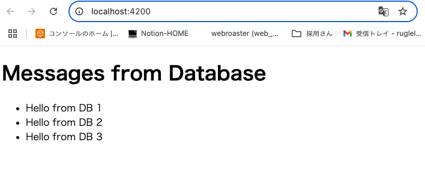

# Lesson 4: データベースとの連携（一覧表示） まとめ

このレッスンでは、バックエンドにインメモリデータベース（H2 Database）を導入し、Spring Data JPA を使ってデータベースとの連携を行いました。これにより、永続的なデータを扱うアプリケーションの基盤を構築し 、そのデータをフロントエンドで一覧表示する方法を学びました。

## 学習目標

- Backend:
  - Spring Data JPA と H2 Database を導入し、データベースとの接続を確立する。
  - データベースのテーブルに対応するエンティティクラスを定義する。
  - データベース操作を行うリポジトリインターフェースを作成する。
  - データベースからメッセージの一覧を取得し、JSON 形式で返す API (/api/messages) を作成する。
- Frontend:
  - バックエンドのメッセージ一覧取得 API を呼び出すサービスを作成する。
  - 取得したメッセージのリストを画面に表示する。
- Goal: データベースに初期投入されたメッセージが、Web ページにリスト形式で表示される。

## Backend (SpringBoot)

キーポイント:

- `pom.xml` の依存関係:
  - spring-boot-starter-data-jpa: Spring Data JPA（Java Persistence API）を簡単に利用するためのスターター。データベース操作を抽象化し、リポジトリインターフェースだけで CRUD 操作を可能にします。
  - h2: 開発時に便利なインメモリデータベース。アプリケーションの起動・停止に合わせてデータが初期化されるため、手軽に試すことができます。
- `@Entity`: Java クラスがデータベースのテーブルに対応するエンティティであることを示します。
- `@Id` と `@GeneratedValue`: エンティティの主キー（Primary Key）と、その値が自動生成されることを示します。
- `JpaRepository<T, ID>`: Spring Data JPA が提供するインターフェース。T はエンティティの型、ID は主キーの型です。このインターフェースを継承するだけで、findAll(), save(), findById(), delete() などの基本的なデータベース操作メソッドが自動的に提供されます。
- `@Autowired`: Spring の DI（Dependency Injection）機能。必要な依存関係（今回は MessageRepository）を自動的に注入してくれます。
- 初期データ投入: アプリケーション起動時に、データベースにいくつかのサンプルデータを投入することで、すぐに動作確認ができるようにしました。

関連ファイル:

- backend/pom.xml （JPA と H2 の依存関係を追加）
- backend/src/main/java/com/example/demo/Message.java （データベースエンティティ）
- backend/src/main/java/com.example/demo/MessageRepository.java （データベースリポジトリ）
- backend/src/main/java/com.example/demo/Lesson4Controller.java （メッセージ一覧取得 API）
- backend/src/test/java/com.example/demo/Lesson4ControllerTest.java （テストコード）

### 実行したコマンド:

```sh
# backend ディレクトリで実行
./mvnw clean install
# 依存関係の更新
# ユニットテストの実行
./mvnw test

./mvnw spring-boot:run # アプリケーションの起動
```

---

## Frontend (Angular)

キーポイント:

- `MessageService`: バックエンドのメッセージ一覧 API と通信するためのサービス。HttpClient.get<Message[]>() を使用して、Message オブジェクトの配列としてデータを受け取ります。
- `Message` インターフェース: バックエンドの Message エンティティに対応する TypeScript のインターフェースを定義し、型安全なデータ操作を可能にしました。
- `ngOnInit` でのデータ取得: コンポーネントが初期化されるタイミングで MessageService を呼び出し、メッセージ一覧を取得してコンポーネントのプロパティに格納します。
- `*ngFor` ディレクティブ: Angular の構造ディレクティブの一つで、配列の各要素を反復処理し、対応する HTML 要素を生成します。これにより、動的なリスト表示が容易になります。
- `*ngIf` ディレクティブ: \*ngFor と組み合わせて、メッセージが一つもない場合に「No messages found.」と表示するなど、条件に応じた表示の切り替えに利用しました。

関連ファイル:

- frontend/src/app/message.service.ts （メッセージ一覧取得サービス）
- frontend/src/app/app.component.ts （メッセージ一覧を取得し、プロパティに格納）
- frontend/src/app/app.component.html （\*ngFor を使ってメッセージ一覧を表示）
- frontend/src/app/message.service.spec.ts （新しいサービステスト）
- frontend/src/app/app.component.spec.ts （更新されたコンポーネントテスト）

### 実行したコマンド:

```sh
# frontend ディレクトリで実行
npm test # ユニットテストの実行
npm start # 開発サーバーの起動
```

## 画面動作確認



## テスト結果: backend

```sh
❯ ./mvnw test
[INFO] Scanning for projects...
[INFO]
[INFO] --------------------------< com.example:demo >--------------------------
[INFO] Building demo 0.0.1-SNAPSHOT
[INFO]   from pom.xml
[INFO] --------------------------------[ jar ]---------------------------------
[INFO]
[INFO] --- resources:3.3.1:resources (default-resources) @ demo ---
[INFO] Copying 1 resource from src/main/resources to target/classes
[INFO] Copying 0 resource from src/main/resources to target/classes
[INFO]
[INFO] --- compiler:3.14.0:compile (default-compile) @ demo ---
[INFO] Nothing to compile - all classes are up to date.
[INFO]
[INFO] --- resources:3.3.1:testResources (default-testResources) @ demo ---
[INFO] skip non existing resourceDirectory /Users/akinishiguchi/Downloads/MOSA/stydy-angular-springboot/backend/src/test/resources
[INFO]
[INFO] --- compiler:3.14.0:testCompile (default-testCompile) @ demo ---
[INFO] Nothing to compile - all classes are up to date.
[INFO]
[INFO] --- surefire:3.5.3:test (default-test) @ demo ---
[INFO] Using auto detected provider org.apache.maven.surefire.junitplatform.JUnitPlatformProvider
[INFO]
[INFO] -------------------------------------------------------
[INFO]  T E S T S
[INFO] -------------------------------------------------------
[INFO] Running com.example.demo.Lesson4ControllerTest
12:03:15.266 [main] INFO org.springframework.test.context.support.AnnotationConfigContextLoaderUtils -- Could not detect default configuration classes for test class [com.example.demo.Lesson4ControllerTest]: Lesson4ControllerTest does not declare any static, non-private, non-final, nested classes annotated with @Configuration.
12:03:15.341 [main] INFO org.springframework.boot.test.context.SpringBootTestContextBootstrapper -- Found @SpringBootConfiguration com.example.demo.DemoApplication for test class com.example.demo.Lesson4ControllerTest
12:03:15.391 [main] INFO org.springframework.boot.devtools.restart.RestartApplicationListener -- Restart disabled due to context in which it is running

  .   ____          _            __ _ _
 /\\ / ___'_ __ _ _(_)_ __  __ _ \ \ \ \
( ( )\___ | '_ | '_| | '_ \/ _` | \ \ \ \
 \\/  ___)| |_)| | | | | || (_| |  ) ) ) )
  '  |____| .__|_| |_|_| |_\__, | / / / /
 =========|_|==============|___/=/_/_/_/

 :: Spring Boot ::                (v3.5.3)

2025-07-01T12:03:15.566+09:00  INFO 98337 --- [demo] [           main] com.example.demo.Lesson4ControllerTest   : Starting Lesson4ControllerTest using Java 17.0.6 with PID 98337 (started by akinishiguchi in /Users/akinishiguchi/Downloads/MOSA/stydy-angular-springboot/backend)
2025-07-01T12:03:15.566+09:00  INFO 98337 --- [demo] [           main] com.example.demo.Lesson4ControllerTest   : No active profile set, falling back to 1 default profile: "default"
OpenJDK 64-Bit Server VM warning: Sharing is only supported for boot loader classes because bootstrap classpath has been appended
2025-07-01T12:03:16.519+09:00  INFO 98337 --- [demo] [           main] o.s.b.t.m.w.SpringBootMockServletContext : Initializing Spring TestDispatcherServlet ''
2025-07-01T12:03:16.519+09:00  INFO 98337 --- [demo] [           main] o.s.t.web.servlet.TestDispatcherServlet  : Initializing Servlet ''
2025-07-01T12:03:16.520+09:00  INFO 98337 --- [demo] [           main] o.s.t.web.servlet.TestDispatcherServlet  : Completed initialization in 0 ms
2025-07-01T12:03:16.535+09:00  INFO 98337 --- [demo] [           main] com.example.demo.Lesson4ControllerTest   : Started Lesson4ControllerTest in 1.149 seconds (process running for 1.602)
[INFO] Tests run: 1, Failures: 0, Errors: 0, Skipped: 0, Time elapsed: 1.447 s -- in com.example.demo.Lesson4ControllerTest
[INFO] Running com.example.demo.Lesson3ControllerTest
2025-07-01T12:03:16.641+09:00  INFO 98337 --- [demo] [           main] t.c.s.AnnotationConfigContextLoaderUtils : Could not detect default configuration classes for test class [com.example.demo.Lesson3ControllerTest]: Lesson3ControllerTest does not declare any static, non-private, non-final, nested classes annotated with @Configuration.
2025-07-01T12:03:16.653+09:00  INFO 98337 --- [demo] [           main] .b.t.c.SpringBootTestContextBootstrapper : Found @SpringBootConfiguration com.example.demo.DemoApplication for test class com.example.demo.Lesson3ControllerTest
2025-07-01T12:03:16.655+09:00  INFO 98337 --- [demo] [           main] o.s.b.d.r.RestartApplicationListener     : Restart disabled due to context in which it is running

  .   ____          _            __ _ _
 /\\ / ___'_ __ _ _(_)_ __  __ _ \ \ \ \
( ( )\___ | '_ | '_| | '_ \/ _` | \ \ \ \
 \\/  ___)| |_)| | | | | || (_| |  ) ) ) )
  '  |____| .__|_| |_|_| |_\__, | / / / /
 =========|_|==============|___/=/_/_/_/

 :: Spring Boot ::                (v3.5.3)

2025-07-01T12:03:16.673+09:00  INFO 98337 --- [demo] [           main] com.example.demo.Lesson3ControllerTest   : Starting Lesson3ControllerTest using Java 17.0.6 with PID 98337 (started by akinishiguchi in /Users/akinishiguchi/Downloads/MOSA/stydy-angular-springboot/backend)
2025-07-01T12:03:16.673+09:00  INFO 98337 --- [demo] [           main] com.example.demo.Lesson3ControllerTest   : No active profile set, falling back to 1 default profile: "default"
2025-07-01T12:03:16.778+09:00  INFO 98337 --- [demo] [           main] o.s.b.t.m.w.SpringBootMockServletContext : Initializing Spring TestDispatcherServlet ''
2025-07-01T12:03:16.779+09:00  INFO 98337 --- [demo] [           main] o.s.t.web.servlet.TestDispatcherServlet  : Initializing Servlet ''
2025-07-01T12:03:16.779+09:00  INFO 98337 --- [demo] [           main] o.s.t.web.servlet.TestDispatcherServlet  : Completed initialization in 0 ms
2025-07-01T12:03:16.785+09:00  INFO 98337 --- [demo] [           main] com.example.demo.Lesson3ControllerTest   : Started Lesson3ControllerTest in 0.13 seconds (process running for 1.851)
[INFO] Tests run: 1, Failures: 0, Errors: 0, Skipped: 0, Time elapsed: 0.170 s -- in com.example.demo.Lesson3ControllerTest
[INFO] Running com.example.demo.DemoApplicationTests
2025-07-01T12:03:16.812+09:00  INFO 98337 --- [demo] [           main] t.c.s.AnnotationConfigContextLoaderUtils : Could not detect default configuration classes for test class [com.example.demo.DemoApplicationTests]: DemoApplicationTests does not declare any static, non-private, non-final, nested classes annotated with @Configuration.
2025-07-01T12:03:16.813+09:00  INFO 98337 --- [demo] [           main] .b.t.c.SpringBootTestContextBootstrapper : Found @SpringBootConfiguration com.example.demo.DemoApplication for test class com.example.demo.DemoApplicationTests
2025-07-01T12:03:16.817+09:00  INFO 98337 --- [demo] [           main] o.s.b.d.r.RestartApplicationListener     : Restart disabled due to context in which it is running

  .   ____          _            __ _ _
 /\\ / ___'_ __ _ _(_)_ __  __ _ \ \ \ \
( ( )\___ | '_ | '_| | '_ \/ _` | \ \ \ \
 \\/  ___)| |_)| | | | | || (_| |  ) ) ) )
  '  |____| .__|_| |_|_| |_\__, | / / / /
 =========|_|==============|___/=/_/_/_/

 :: Spring Boot ::                (v3.5.3)

2025-07-01T12:03:16.829+09:00  INFO 98337 --- [demo] [           main] com.example.demo.DemoApplicationTests    : Starting DemoApplicationTests using Java 17.0.6 with PID 98337 (started by akinishiguchi in /Users/akinishiguchi/Downloads/MOSA/stydy-angular-springboot/backend)
2025-07-01T12:03:16.829+09:00  INFO 98337 --- [demo] [           main] com.example.demo.DemoApplicationTests    : No active profile set, falling back to 1 default profile: "default"
2025-07-01T12:03:16.961+09:00  INFO 98337 --- [demo] [           main] .s.d.r.c.RepositoryConfigurationDelegate : Bootstrapping Spring Data JPA repositories in DEFAULT mode.
2025-07-01T12:03:16.979+09:00  INFO 98337 --- [demo] [           main] .s.d.r.c.RepositoryConfigurationDelegate : Finished Spring Data repository scanning in 13 ms. Found 1 JPA repository interface.
2025-07-01T12:03:17.088+09:00  INFO 98337 --- [demo] [           main] com.zaxxer.hikari.HikariDataSource       : HikariPool-1 - Starting...
2025-07-01T12:03:17.196+09:00  INFO 98337 --- [demo] [           main] com.zaxxer.hikari.pool.HikariPool        : HikariPool-1 - Added connection conn0: url=jdbc:h2:mem:dfcfcd17-22ea-45f6-9800-3ca45673ad2f user=SA
2025-07-01T12:03:17.197+09:00  INFO 98337 --- [demo] [           main] com.zaxxer.hikari.HikariDataSource       : HikariPool-1 - Start completed.
2025-07-01T12:03:17.222+09:00  INFO 98337 --- [demo] [           main] o.hibernate.jpa.internal.util.LogHelper  : HHH000204: Processing PersistenceUnitInfo [name: default]
2025-07-01T12:03:17.254+09:00  INFO 98337 --- [demo] [           main] org.hibernate.Version                    : HHH000412: Hibernate ORM core version 6.6.18.Final
2025-07-01T12:03:17.273+09:00  INFO 98337 --- [demo] [           main] o.h.c.internal.RegionFactoryInitiator    : HHH000026: Second-level cache disabled
2025-07-01T12:03:17.359+09:00  INFO 98337 --- [demo] [           main] o.s.o.j.p.SpringPersistenceUnitInfo      : No LoadTimeWeaver setup: ignoring JPA class transformer
2025-07-01T12:03:17.415+09:00  INFO 98337 --- [demo] [           main] org.hibernate.orm.connections.pooling    : HHH10001005: Database info:
        Database JDBC URL [Connecting through datasource 'HikariDataSource (HikariPool-1)']
        Database driver: undefined/unknown
        Database version: 2.3.232
        Autocommit mode: undefined/unknown
        Isolation level: undefined/unknown
        Minimum pool size: undefined/unknown
        Maximum pool size: undefined/unknown
2025-07-01T12:03:17.781+09:00  INFO 98337 --- [demo] [           main] o.h.e.t.j.p.i.JtaPlatformInitiator       : HHH000489: No JTA platform available (set 'hibernate.transaction.jta.platform' to enable JTA platform integration)
2025-07-01T12:03:17.799+09:00  INFO 98337 --- [demo] [           main] j.LocalContainerEntityManagerFactoryBean : Initialized JPA EntityManagerFactory for persistence unit 'default'
2025-07-01T12:03:18.171+09:00  WARN 98337 --- [demo] [           main] JpaBaseConfiguration$JpaWebConfiguration : spring.jpa.open-in-view is enabled by default. Therefore, database queries may be performed during view rendering. Explicitly configure spring.jpa.open-in-view to disable this warning
2025-07-01T12:03:18.247+09:00  INFO 98337 --- [demo] [           main] com.example.demo.DemoApplicationTests    : Started DemoApplicationTests in 1.43 seconds (process running for 3.313)
[INFO] Tests run: 1, Failures: 0, Errors: 0, Skipped: 0, Time elapsed: 1.440 s -- in com.example.demo.DemoApplicationTests
[INFO] Running com.example.demo.Lesson1ControllerTest
2025-07-01T12:03:18.253+09:00  INFO 98337 --- [demo] [           main] t.c.s.AnnotationConfigContextLoaderUtils : Could not detect default configuration classes for test class [com.example.demo.Lesson1ControllerTest]: Lesson1ControllerTest does not declare any static, non-private, non-final, nested classes annotated with @Configuration.
2025-07-01T12:03:18.258+09:00  INFO 98337 --- [demo] [           main] .b.t.c.SpringBootTestContextBootstrapper : Found @SpringBootConfiguration com.example.demo.DemoApplication for test class com.example.demo.Lesson1ControllerTest
2025-07-01T12:03:18.260+09:00  INFO 98337 --- [demo] [           main] o.s.b.d.r.RestartApplicationListener     : Restart disabled due to context in which it is running

  .   ____          _            __ _ _
 /\\ / ___'_ __ _ _(_)_ __  __ _ \ \ \ \
( ( )\___ | '_ | '_| | '_ \/ _` | \ \ \ \
 \\/  ___)| |_)| | | | | || (_| |  ) ) ) )
  '  |____| .__|_| |_|_| |_\__, | / / / /
 =========|_|==============|___/=/_/_/_/

 :: Spring Boot ::                (v3.5.3)

2025-07-01T12:03:18.272+09:00  INFO 98337 --- [demo] [           main] com.example.demo.Lesson1ControllerTest   : Starting Lesson1ControllerTest using Java 17.0.6 with PID 98337 (started by akinishiguchi in /Users/akinishiguchi/Downloads/MOSA/stydy-angular-springboot/backend)
2025-07-01T12:03:18.272+09:00  INFO 98337 --- [demo] [           main] com.example.demo.Lesson1ControllerTest   : No active profile set, falling back to 1 default profile: "default"
2025-07-01T12:03:18.330+09:00  INFO 98337 --- [demo] [           main] o.s.b.t.m.w.SpringBootMockServletContext : Initializing Spring TestDispatcherServlet ''
2025-07-01T12:03:18.330+09:00  INFO 98337 --- [demo] [           main] o.s.t.web.servlet.TestDispatcherServlet  : Initializing Servlet ''
2025-07-01T12:03:18.330+09:00  INFO 98337 --- [demo] [           main] o.s.t.web.servlet.TestDispatcherServlet  : Completed initialization in 0 ms
2025-07-01T12:03:18.333+09:00  INFO 98337 --- [demo] [           main] com.example.demo.Lesson1ControllerTest   : Started Lesson1ControllerTest in 0.073 seconds (process running for 3.399)
[INFO] Tests run: 1, Failures: 0, Errors: 0, Skipped: 0, Time elapsed: 0.086 s -- in com.example.demo.Lesson1ControllerTest
[INFO]
[INFO] Results:
[INFO]
[INFO] Tests run: 4, Failures: 0, Errors: 0, Skipped: 0
[INFO]
[INFO] ------------------------------------------------------------------------
[INFO] BUILD SUCCESS
[INFO] ------------------------------------------------------------------------
[INFO] Total time:  4.115 s
[INFO] Finished at: 2025-07-01T12:03:18+09:00      r test class [com.example.demo.Lesson4ControllerTest]: Lesson4ControllerTest does not declare any stat
```

## テスト結果: frontend

```sh
❯ npm run test

> frontend@0.0.0 test
> ng test

✔ Browser application bundle generation complete.
⠙ Generating browser application bundles (phase: building)...01 07 2025 12:16:03.822:WARN [karma]: No captured browser, open http://localhost:9876/
01 07 2025 12:16:03.835:INFO [karma-server]: Karma v6.4.4 server started at http://localhost:9876/
01 07 2025 12:16:03.835:INFO [launcher]: Launching browsers Chrome with concurrency unlimited
01 07 2025 12:16:03.837:INFO [launcher]: Starting browser Chrome
✔ Browser application bundle generation complete.
✔ Browser application bundle generation complete.
01 07 2025 12:16:05.208:INFO [Chrome 138.0.0.0 (Mac OS 10.15.7)]: Connected on socket k6Wqi9sIWrYfu61HAAAB with id 79612509
Chrome 138.0.0.0 (Mac OS 10.15.7): Executed 9 of 9 SUCCESS (0.048 secs / 0.041 secs)
TOTAL: 9 SUCCESS
```
