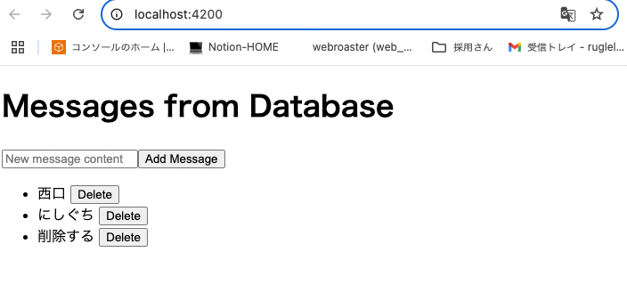
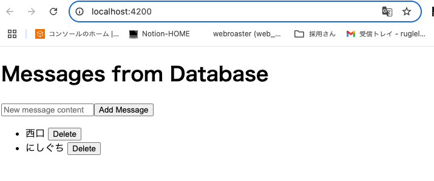

# Lesson 5: データの追加と削除 まとめ

このレッスンでは、データベースに保存されたデータを、フロントエンドから追加・削除する機能を実現しました。こ れにより、ユーザーがアプリケーションのデータを直接操作できる、より完全な CRUD（Create, Read, Update, Delete）操作の一端を学びました。

## 学習目標

- Backend:
  - 新しいメッセージをデータベースに登録する API (POST /api/messages) を作成する。
  - 指定された ID のメッセージをデータベースから削除する API (DELETE /api/messages/{id}) を作成する。
- Frontend:
  - メッセージの入力フォームと追加ボタンを実装し、バックエンドの追加 API を呼び出す。
  - 各メッセージの隣に削除ボタンを実装し、バックエンドの削除 API を呼び出す。
  - 追加・削除後にメッセージリストを自動的に更新する。
- Goal: ユーザーが Web ページからメッセージを追加・削除でき、その変更がリアルタイムでリストに反映される。

## Backend (SpringBoot)

キーポイント:

- `@PostMapping` (追加): 新しいリソース（メッセージ）を作成するために使用します。リクエストボディから Message オブジェクトを受け取り、MessageRepository.save()でデータベースに保存します。
- `@DeleteMapping("/{id}")` (削除): 特定のリソース（メッセージ）を削除するために使用します。URL パスから ID を受け取るために@PathVariable を使用し、MessageRepository.deleteById()でデータベースから削除します。
- `ResponseEntity<Void>` と `HttpStatus.NO_CONTENT`: 削除 API のように、成功してもレスポンスボディを返さない場合、ResponseEntity を使って HTTP ステータスコード 204 No Content を明示的に返すのが一般的です。
- `Message` エンティティのコンストラクタ: テストの利便性を高めるため、ID とコンテンツを引数に取るコンストラクタを追加しました。

関連ファイル:

- backend/src/main/java/com/example/demo/Lesson5Controller.java （追加・削除 API の実装）
- backend/src/main/java/com/example/demo/Message.java （コンストラクタの追加）
- backend/src/test/java/com.example/demo/Lesson5ControllerTest.java （追加・削除 API のテスト）

---

## Frontend (Angular)

キーポイント:

- `FormsModule` と `[(ngModel)]`:
  - FormsModule を app.config.ts にインポートし、imports 配列に追加することで、Angular のテンプレート駆動フォーム機能を利用できるようになります。
  - [(ngModel)]は「双方向データバインディング」を実現するディレクティブです。HTML の入力要素（<input>など）とコンポーネントのプロパティ（今回は newMessageContent）を同期させ、ユーザーの入力が即座にプロパティに反映され、プロパティの変更が即座に UI に反映されるようにします。
- `MessageService.addMessage()`: HttpClient.post<Message>() を使用して、新しいメッセージオブジェクトをバックエンドに送信します。
- `MessageService.deleteMessage()`: HttpClient.delete<void>() を使用して、指定された ID のメッセージをバックエンドに削除リクエストを送信します。
- リストの更新: メッセージの追加や削除が成功した後、loadMessages() メソッドを再度呼び出すことで、最新のメッセージリストをバックエンドから取得し、画面表示をリアルタイムで更新しました。これは、ユーザー体験を向上させる上で非常に重要です。

関連ファイル:

- frontend/src/app/message.service.ts （追加・削除メソッドの追加）
- frontend/src/app/app.component.ts （追加・削除ロジックの実装とリスト更新）
- frontend/src/app/app.component.html （入力フォーム、追加ボタン、削除ボタンの追加）
- frontend/src/app/app.config.ts （provideForms() の追加）
- frontend/src/app/message.service.spec.ts （追加・削除メソッドのテスト）
- frontend/src/app/app.component.spec.ts （追加・削除ロジックのテスト）

## 動作確認





## テスト結果: backend

```sh
❯ ./mvnw test
[INFO] Scanning for projects...
[INFO]
[INFO] --------------------------< com.example:demo >--------------------------
[INFO] Building demo 0.0.1-SNAPSHOT
[INFO]   from pom.xml
[INFO] --------------------------------[ jar ]---------------------------------
[INFO]
[INFO] --- resources:3.3.1:resources (default-resources) @ demo ---
[INFO] Copying 1 resource from src/main/resources to target/classes
[INFO] Copying 0 resource from src/main/resources to target/classes
[INFO]
[INFO] --- compiler:3.14.0:compile (default-compile) @ demo ---
[INFO] Nothing to compile - all classes are up to date.
[INFO]
[INFO] --- resources:3.3.1:testResources (default-testResources) @ demo ---
[INFO] skip non existing resourceDirectory /Users/akinishiguchi/Downloads/MOSA/stydy-angular-springboot/backend/src/test/resources
[INFO]
[INFO] --- compiler:3.14.0:testCompile (default-testCompile) @ demo ---
[INFO] Nothing to compile - all classes are up to date.
[INFO]
[INFO] --- surefire:3.5.3:test (default-test) @ demo ---
[INFO] Using auto detected provider org.apache.maven.surefire.junitplatform.JUnitPlatformProvider
[INFO]
[INFO] -------------------------------------------------------
[INFO]  T E S T S
[INFO] -------------------------------------------------------
[INFO] Running com.example.demo.Lesson5ControllerTest
12:47:20.315 [main] INFO org.springframework.test.context.support.AnnotationConfigContextLoaderUtils -- Could not detect default configuration classes for test class [com.example.demo.Lesson5ControllerTest]: Lesson5ControllerTest does not declare any static, non-private, non-final, nested classes annotated with @Configuration.
12:47:20.410 [main] INFO org.springframework.boot.test.context.SpringBootTestContextBootstrapper -- Found @SpringBootConfiguration com.example.demo.DemoApplication for test class com.example.demo.Lesson5ControllerTest
12:47:20.461 [main] INFO org.springframework.boot.devtools.restart.RestartApplicationListener -- Restart disabled due to context in which it is running

  .   ____          _            __ _ _
 /\\ / ___'_ __ _ _(_)_ __  __ _ \ \ \ \
( ( )\___ | '_ | '_| | '_ \/ _` | \ \ \ \
 \\/  ___)| |_)| | | | | || (_| |  ) ) ) )
  '  |____| .__|_| |_|_| |_\__, | / / / /
 =========|_|==============|___/=/_/_/_/

 :: Spring Boot ::                (v3.5.3)

2025-07-01T12:47:20.656+09:00  INFO 1261 --- [demo] [           main] com.example.demo.Lesson5ControllerTest   : Starting Lesson5ControllerTest using Java 17.0.6 with PID 1261 (started by akinishiguchi in /Users/akinishiguchi/Downloads/MOSA/stydy-angular-springboot/backend)
2025-07-01T12:47:20.657+09:00  INFO 1261 --- [demo] [           main] com.example.demo.Lesson5ControllerTest   : No active profile set, falling back to 1 default profile: "default"
OpenJDK 64-Bit Server VM warning: Sharing is only supported for boot loader classes because bootstrap classpath has been appended
2025-07-01T12:47:21.676+09:00  INFO 1261 --- [demo] [           main] o.s.b.t.m.w.SpringBootMockServletContext : Initializing Spring TestDispatcherServlet ''
2025-07-01T12:47:21.677+09:00  INFO 1261 --- [demo] [           main] o.s.t.web.servlet.TestDispatcherServlet  : Initializing Servlet ''
2025-07-01T12:47:21.678+09:00  INFO 1261 --- [demo] [           main] o.s.t.web.servlet.TestDispatcherServlet  : Completed initialization in 0 ms
2025-07-01T12:47:21.695+09:00  INFO 1261 --- [demo] [           main] com.example.demo.Lesson5ControllerTest   : Started Lesson5ControllerTest in 1.239 seconds (process running for 1.77)
[INFO] Tests run: 3, Failures: 0, Errors: 0, Skipped: 0, Time elapsed: 1.604 s -- in com.example.demo.Lesson5ControllerTest
[INFO] Running com.example.demo.Lesson4ControllerTest
2025-07-01T12:47:21.839+09:00  INFO 1261 --- [demo] [           main] t.c.s.AnnotationConfigContextLoaderUtils : Could not detect default configuration classes for test class [com.example.demo.Lesson4ControllerTest]: Lesson4ControllerTest does not declare any static, non-private, non-final, nested classes annotated with @Configuration.
2025-07-01T12:47:21.846+09:00  INFO 1261 --- [demo] [           main] .b.t.c.SpringBootTestContextBootstrapper : Found @SpringBootConfiguration com.example.demo.DemoApplication for test class com.example.demo.Lesson4ControllerTest
2025-07-01T12:47:21.849+09:00  INFO 1261 --- [demo] [           main] o.s.b.d.r.RestartApplicationListener     : Restart disabled due to context in which it is running

  .   ____          _            __ _ _
 /\\ / ___'_ __ _ _(_)_ __  __ _ \ \ \ \
( ( )\___ | '_ | '_| | '_ \/ _` | \ \ \ \
 \\/  ___)| |_)| | | | | || (_| |  ) ) ) )
  '  |____| .__|_| |_|_| |_\__, | / / / /
 =========|_|==============|___/=/_/_/_/

 :: Spring Boot ::                (v3.5.3)

2025-07-01T12:47:21.868+09:00  INFO 1261 --- [demo] [           main] com.example.demo.Lesson4ControllerTest   : Starting Lesson4ControllerTest using Java 17.0.6 with PID 1261 (started by akinishiguchi in /Users/akinishiguchi/Downloads/MOSA/stydy-angular-springboot/backend)
2025-07-01T12:47:21.869+09:00  INFO 1261 --- [demo] [           main] com.example.demo.Lesson4ControllerTest   : No active profile set, falling back to 1 default profile: "default"
2025-07-01T12:47:21.982+09:00  INFO 1261 --- [demo] [           main] o.s.b.t.m.w.SpringBootMockServletContext : Initializing Spring TestDispatcherServlet ''
2025-07-01T12:47:21.982+09:00  INFO 1261 --- [demo] [           main] o.s.t.web.servlet.TestDispatcherServlet  : Initializing Servlet ''
2025-07-01T12:47:21.982+09:00  INFO 1261 --- [demo] [           main] o.s.t.web.servlet.TestDispatcherServlet  : Completed initialization in 0 ms
2025-07-01T12:47:21.987+09:00  INFO 1261 --- [demo] [           main] com.example.demo.Lesson4ControllerTest   : Started Lesson4ControllerTest in 0.138 seconds (process running for 2.062)
[INFO] Tests run: 1, Failures: 0, Errors: 0, Skipped: 0, Time elapsed: 0.159 s -- in com.example.demo.Lesson4ControllerTest
[INFO] Running com.example.demo.Lesson3ControllerTest
2025-07-01T12:47:22.001+09:00  INFO 1261 --- [demo] [           main] t.c.s.AnnotationConfigContextLoaderUtils : Could not detect default configuration classes for test class [com.example.demo.Lesson3ControllerTest]: Lesson3ControllerTest does not declare any static, non-private, non-final, nested classes annotated with @Configuration.
2025-07-01T12:47:22.013+09:00  INFO 1261 --- [demo] [           main] .b.t.c.SpringBootTestContextBootstrapper : Found @SpringBootConfiguration com.example.demo.DemoApplication for test class com.example.demo.Lesson3ControllerTest
2025-07-01T12:47:22.014+09:00  INFO 1261 --- [demo] [           main] o.s.b.d.r.RestartApplicationListener     : Restart disabled due to context in which it is running

  .   ____          _            __ _ _
 /\\ / ___'_ __ _ _(_)_ __  __ _ \ \ \ \
( ( )\___ | '_ | '_| | '_ \/ _` | \ \ \ \
 \\/  ___)| |_)| | | | | || (_| |  ) ) ) )
  '  |____| .__|_| |_|_| |_\__, | / / / /
 =========|_|==============|___/=/_/_/_/

 :: Spring Boot ::                (v3.5.3)

2025-07-01T12:47:22.024+09:00  INFO 1261 --- [demo] [           main] com.example.demo.Lesson3ControllerTest   : Starting Lesson3ControllerTest using Java 17.0.6 with PID 1261 (started by akinishiguchi in /Users/akinishiguchi/Downloads/MOSA/stydy-angular-springboot/backend)
2025-07-01T12:47:22.025+09:00  INFO 1261 --- [demo] [           main] com.example.demo.Lesson3ControllerTest   : No active profile set, falling back to 1 default profile: "default"
2025-07-01T12:47:22.111+09:00  INFO 1261 --- [demo] [           main] o.s.b.t.m.w.SpringBootMockServletContext : Initializing Spring TestDispatcherServlet ''
2025-07-01T12:47:22.111+09:00  INFO 1261 --- [demo] [           main] o.s.t.web.servlet.TestDispatcherServlet  : Initializing Servlet ''
2025-07-01T12:47:22.111+09:00  INFO 1261 --- [demo] [           main] o.s.t.web.servlet.TestDispatcherServlet  : Completed initialization in 0 ms
2025-07-01T12:47:22.115+09:00  INFO 1261 --- [demo] [           main] com.example.demo.Lesson3ControllerTest   : Started Lesson3ControllerTest in 0.101 seconds (process running for 2.19)
[INFO] Tests run: 1, Failures: 0, Errors: 0, Skipped: 0, Time elapsed: 0.122 s -- in com.example.demo.Lesson3ControllerTest
[INFO] Running com.example.demo.DemoApplicationTests
[WARNING] Tests run: 1, Failures: 0, Errors: 0, Skipped: 1, Time elapsed: 0.001 s -- in com.example.demo.DemoApplicationTests
[INFO] Running com.example.demo.Lesson1ControllerTest
2025-07-01T12:47:22.126+09:00  INFO 1261 --- [demo] [           main] t.c.s.AnnotationConfigContextLoaderUtils : Could not detect default configuration classes for test class [com.example.demo.Lesson1ControllerTest]: Lesson1ControllerTest does not declare any static, non-private, non-final, nested classes annotated with @Configuration.
2025-07-01T12:47:22.133+09:00  INFO 1261 --- [demo] [           main] .b.t.c.SpringBootTestContextBootstrapper : Found @SpringBootConfiguration com.example.demo.DemoApplication for test class com.example.demo.Lesson1ControllerTest
2025-07-01T12:47:22.134+09:00  INFO 1261 --- [demo] [           main] o.s.b.d.r.RestartApplicationListener     : Restart disabled due to context in which it is running

  .   ____          _            __ _ _
 /\\ / ___'_ __ _ _(_)_ __  __ _ \ \ \ \
( ( )\___ | '_ | '_| | '_ \/ _` | \ \ \ \
 \\/  ___)| |_)| | | | | || (_| |  ) ) ) )
  '  |____| .__|_| |_|_| |_\__, | / / / /
 =========|_|==============|___/=/_/_/_/

 :: Spring Boot ::                (v3.5.3)

2025-07-01T12:47:22.146+09:00  INFO 1261 --- [demo] [           main] com.example.demo.Lesson1ControllerTest   : Starting Lesson1ControllerTest using Java 17.0.6 with PID 1261 (started by akinishiguchi in /Users/akinishiguchi/Downloads/MOSA/stydy-angular-springboot/backend)
2025-07-01T12:47:22.146+09:00  INFO 1261 --- [demo] [           main] com.example.demo.Lesson1ControllerTest   : No active profile set, falling back to 1 default profile: "default"
2025-07-01T12:47:22.223+09:00  INFO 1261 --- [demo] [           main] o.s.b.t.m.w.SpringBootMockServletContext : Initializing Spring TestDispatcherServlet ''
2025-07-01T12:47:22.223+09:00  INFO 1261 --- [demo] [           main] o.s.t.web.servlet.TestDispatcherServlet  : Initializing Servlet ''
2025-07-01T12:47:22.223+09:00  INFO 1261 --- [demo] [           main] o.s.t.web.servlet.TestDispatcherServlet  : Completed initialization in 0 ms
2025-07-01T12:47:22.227+09:00  INFO 1261 --- [demo] [           main] com.example.demo.Lesson1ControllerTest   : Started Lesson1ControllerTest in 0.093 seconds (process running for 2.302)
[INFO] Tests run: 1, Failures: 0, Errors: 0, Skipped: 0, Time elapsed: 0.107 s -- in com.example.demo.Lesson1ControllerTest
[INFO]
[INFO] Results:
[INFO]
[WARNING] Tests run: 7, Failures: 0, Errors: 0, Skipped: 1
[INFO]
[INFO] ------------------------------------------------------------------------
[INFO] BUILD SUCCESS
[INFO] ------------------------------------------------------------------------
[INFO] Total time:  2.929 s
[INFO] Finished at: 2025-07-01T12:47:22+09:00
[INFO] ------------------------------------------------------------------------
```

## テスト結果: frontend

```sh
❯ npm run test

> frontend@0.0.0 test
> ng test

✔ Browser application bundle generation complete.
⠙ Generating browser application bundles (phase: building)...01 07 2025 13:05:37.390:WARN [karma]: No captured browser, open http://localhost:9876/
01 07 2025 13:05:37.403:INFO [karma-server]: Karma v6.4.4 server started at http://localhost:9876/
01 07 2025 13:05:37.403:INFO [launcher]: Launching browsers Chrome with concurrency unlimited
01 07 2025 13:05:37.406:INFO [launcher]: Starting browser Chrome
✔ Browser application bundle generation complete.
✔ Browser application bundle generation complete.
01 07 2025 13:05:38.321:INFO [Chrome 138.0.0.0 (Mac OS 10.15.7)]: Connected on socket JxHHgiW68d91zHjaAAAB with id 65535128
Chrome 138.0.0.0 (Mac OS 10.15.7): Executed 13 of 13 SUCCESS (0.069 secs / 0.053 secs)
TOTAL: 13 SUCCESS
```
