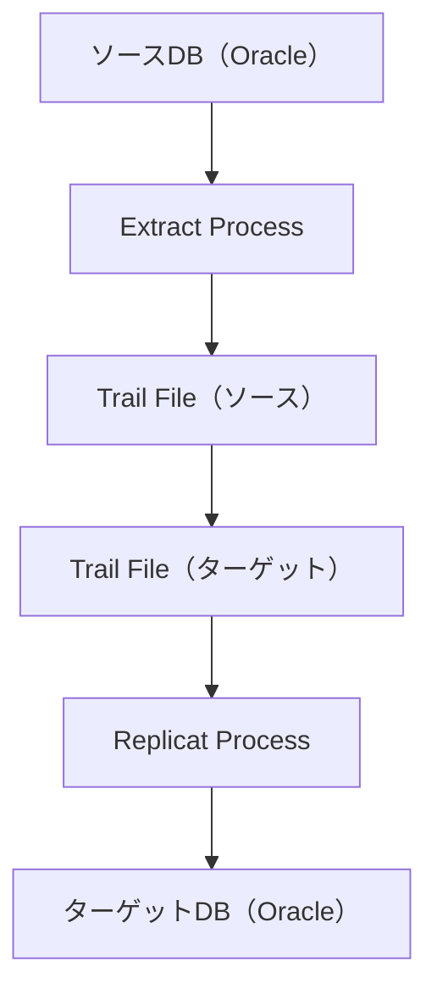

# Oracle GoldenGate

## ✅ Oracle Database（Oracle DB）とは？

**Oracle Database** は、**Oracle 社が提供するリレーショナル・データベース管理システム（RDBMS）** です。

### 主な特徴：

- 大規模で高性能なデータベース管理
- トランザクション処理、SQL によるデータ操作
- セキュリティ、バックアップ、レプリケーションなど豊富な機能
- 多くの企業で業務システムの基盤として使用

## ✅ Oracle GoldenGate とは？

**Oracle GoldenGate** は、**データベース間でリアルタイムにデータを複製・同期するツール** です。Oracle だけでなく、他社製 DB（MySQL、SQL Server など）との連携も可能です。

### 主な特徴：

- **リアルタイムデータ複製**（遅延がほぼない）
- **異種 DB 間レプリケーション**（Oracle ⇄ MySQL など）
- **変更データキャプチャ（CDC）**：トランザクションログを読み取り、変更のみを転送
- **災害対策（DR）構成やシステム移行**にも活用される

## 🔍 両者の違いまとめ

| 項目         | Oracle Database                         | Oracle GoldenGate                             |
| ------------ | --------------------------------------- | --------------------------------------------- |
| 種類         | データベースそのもの                    | データ複製・同期のためのツール                |
| 主な役割     | データの保存・管理・問い合わせ          | データの複製・移行・同期                      |
| 処理対象     | SQL によるデータ操作や管理処理          | 変更されたデータのみをキャプチャして転送      |
| 使用場面     | 通常の業務システムや Web サービスの基盤 | 本番から別環境への同期、災害対策、DB 移行など |
| サポート対象 | 主に Oracle 製 DB                       | Oracle だけでなく、他社製 DB にも対応         |

## 🔧 Oracle GoldenGate の基本構成

GoldenGate は、**ソース DB（送り手）からターゲット DB（受け手）へ、データの変更内容をリアルタイムで複製**します。

以下の 3 つの主要なコンポーネントで構成されます：

### 1. **Extract（エクストラクト）プロセス：変更データの抽出**

- ソース DB（たとえば本番環境）で発生した**トランザクションログ（REDO ログ）**から、**データ変更（INSERT、UPDATE、DELETE）をキャプチャ**します。
- 抽出されたデータは中間ファイル（Trail）に書き出されます。

🔸 例：

「社員テーブルで田中さんの部署が変更された」という変更をログから抜き取ります。

---

### 2. **Trail ファイル：変更データの一時保存**

- **Trail（トレイル）ファイル**は、変更データを一時的に保存するファイルです。
- 通常、ソース側に「**ローカルトレイル**」、ターゲット側に「**リモートトレイル**」が作られます。
- 非同期で Extract → Replicat 間の橋渡しをします。

🔸 特徴：

- 途中でネットワーク障害などが起きても再送できる
- ログ構造の標準化（DB 間の違いを吸収）

---

### 3. **Replicat（レプリキャット）プロセス：データの反映**

- Trail ファイルに保存された変更データを、**ターゲット DB へ適用**します。
- INSERT、UPDATE、DELETE として実行され、**ターゲット DB の状態をソース DB と同期**させます。

🔸 例：

ソース側で田中さんの部署が「営業部」→「開発部」に変更されたのと同じ操作を、ターゲット側でも実行。

## ✅ 1. 準備段階：必要なもの

| 項目                    | 内容                                                               |
| ----------------------- | ------------------------------------------------------------------ |
| ソース DB               | Oracle Database（対応バージョン：12c 以降を推奨）                  |
| ターゲット DB           | 同上                                                               |
| GoldenGate ソフトウェア | Oracle GoldenGate（バージョンは DB に対応したもの）                |
| OS ユーザー             | Oracle DB と GoldenGate を動かすための OS ユーザー（例：`oracle`） |
| ストレージ              | Trail ファイル用の十分なディスク領域                               |
| ネットワーク            | ソース ↔ ターゲット間の通信ポート（デフォルトは 7809 など）        |

---

## ✅ 2. ソフトウェアのインストール

### GoldenGate のダウンロードとインストール：

1. Oracle 公式サイトから GoldenGate をダウンロード

   https://www.oracle.com/middleware/technologies/goldengate-downloads.html

2. ソース DB、ターゲット DB それぞれのサーバーにインストール

```sql
-- アーカイブログモードが必要
archive log list
-- 補足ログも必要
ALTER DATABASE ADD SUPPLEMENTAL LOG DATA;
```

---

## ✅ 3. ソース DB の設定（Extract の準備）

### 🔹 ① ログモードの確認と設定

```sql
-- アーカイブログモードが必要
archive log list
-- 補足ログも必要
ALTER DATABASE ADD SUPPLEMENTAL LOG DATA;
```

### 🔹 ② GoldenGate 用ユーザー作成（例）

```sql
CREATE USER ggs_admin IDENTIFIED BY password;
GRANT DBA TO ggs_admin;
-- GoldenGate用の専用権限
BEGIN
  DBMS_GOLDENGATE_AUTH.GRANT_ADMIN_PRIVILEGE('GGS_ADMIN');
END;
/
```

---

## ✅ 4. ターゲット DB の設定（Replicat の準備）

ソース側と同じく、ターゲットにも GoldenGate をインストールし、Trail ファイルを受け取り、DB に適用できるように設定。

ユーザーも `ggs_admin` を作っておく。

---

## ✅ 5. GoldenGate 設定（コマンド例）

GoldenGate のコンソールに入る：

```bash
./ggsci
```

### 🔹 Extract の作成（ソース側）

```bash
ADD EXTRACT ext01, TRANLOG, BEGIN NOW
ADD EXTTRAIL ./dirdat/et, EXTRACT ext01
```

### 🔹 Replicat の作成（ターゲット側）

```bash
ADD REPLICAT rep01, EXTTRAIL ./dirdat/et, MAP source_schema.*, TARGET target_schema.*;
```

---

## ✅ 6. データマッピングと動作開始

### 🔹 PARAMS ファイルの設定（Extract/Replicat ごとに）

例：`params/ext01` の中身

```
EXTRACT ext01
USERID ggs_admin, PASSWORD your_password
EXTTRAIL ./dirdat/et
TABLE schema_name.*;
```

例：`params/rep01` の中身

```
REPLICAT rep01
USERID ggs_admin, PASSWORD your_password
MAP schema_name.*, TARGET schema_name.*;
```

### 🔹 プロセスの起動

```bash
START EXTRACT ext01
START REPLICAT rep01
```

---

## ✅ 7. 動作確認

GoldenGate のステータス確認：

```bash
INFO EXTRACT ext01
INFO REPLICAT rep01
```

実際はもう少し複雑な設定が必要で、ここでは簡略した手順を記載

ターゲット DB にデータが複製されているかどうかを確認。

## 💡 補足：構成イメージ



## 💡 補足：Oracle GoldenGate (OGG) の設定は、パラメータファイルという形でまとめて記述が可能

### 🔹 OGG のパラメータファイルの構造と管理

OGG は、基本的に以下の 2 種類のパラメータファイルを使用します。

- **GLOBALS ファイル (GLOBALS):**
  - OGG インストールディレクトリの直下に配置する
  - Manager プロセスを含む、すべての OGG プロセスに影響するグローバルな設定を記述
  - 例: `GGSCHEMA` (OGG 内部オブジェクトが作成されるスキーマ)、`CHECKPOINTTABLE` のデフォルト設定など
  - 通常は 1 つのファイルで、内容も頻繁には変更されないもの
- **ランタイムパラメータファイル (プロセス名.prm):**
  - 各 OGG プロセス（Manager, Extract, Data Pump, Replicat）ごとに作成される個別の設定ファイル
  - Manager プロセスは `MGR.prm` というファイル名で管理される
  - Extract プロセスは `E*<プロセス名>.prm`、Data Pump は `DP*<プロセス名>.prm`、Replicat プロセスは `R_<プロセス名>.prm` のように、一意のファイル名で作成される
  - これらのファイルは、通常 `GG_HOME/dirprm` ディレクトリに保存する
  - 各ファイルの内部には、そのプロセスに特化したパラメータ（DB 接続情報、テーブル指定、フィルタリング条件、エラーハンドリングなど）が記述される

### 🔹 設定ファイルの記述方法

GGSCI の `EDIT PARAMS <ファイル名>` コマンドを使用すると、自動的に `dirprm` ディレクトリにファイルが作成され、テキストエディタで開かれます。

手動でテキストエディタを使ってファイルを作成し、`dirprm` ディレクトリに保存することも可能です。

**例: Extract プロセスのパラメータファイル（`E_MEMBER_CDC.prm`）**

```sql
-- E_MEMBER_CDC.prm
-- 会員情報変更データキャプチャ用Extractプロセス

-- データベースへのログイン情報
-- OGG専用ユーザーのユーザーIDとパスワードを指定します
USERID ggs_admin, PASSWORD password

-- 変更データをキャプチャする開始位置 (通常、新規作成時はNOW)
-- TRANLOGOPTIONS DBLOGREADERはOracle統合キャプチャモードを使用する場合に必須です
TRANLOGOPTIONS DBLOGREADER
BEGIN NOW

-- キャプチャした変更データを書き込むローカルトレイルのパスとプレフィックス
-- これがData Pumpプロセスに引き渡されます
EXTTRAIL /u01/app/ogg/dirdat/lt

-- 同期対象のテーブルを指定
-- スキーマ名とテーブル名を記述します
TABLE source_schema.members, WHERE (status = 'ACTIVE'); -- 'ACTIVE'な会員のみ同期するフィルタリング条件

-- その他の一般的な設定（必要に応じて追加）
-- エラー発生時の動作を定義
-- DBERROR ON ABEND

-- レポートの出力頻度など
-- REPORTCOUNT EVERY 1 HOUR, RATE
-- REPORTROLLOVER AT 00:00 ON SUNDAY
```

これらのパラメータファイルを使って適応させるには GGSCI コマンドラインツールで操作します。

### 🔹 パラメータファイルの作成と編集

GGSCI の `EDIT PARAMS` コマンドを使用して指定されたプロセス名のパラメータファイルを GGSCI が自動的に探す（または作成し、）デフォルトのテキストエディタが開かれます。（`vi` または `notepad` など）

- Manager プロセスの設定を変更する場合

  ```bash
  GGSCI> EDIT PARAMS MGR
  ```

- Extract プロセスの設定を変更する場合（例: `E_MEMBER_CDC`）

  ```bash
  GGSCI> EDIT PARAMS E_MEMBER_CDC
  ```

- Replicat プロセスの設定を変更する場合（例: `R_MEMBER_CDC`）

  ```bash
  GGSCI> EDIT PARAMS R_MEMBER_CDC
  ```

- GLOBALS ファイルを編集する場合

  ```bash
  GGSCI> EDIT PARAMS ./GLOBALS
  ```

エディタでファイルが開いたら、必要なパラメータを記述・修正し、保存してエディタを終了します。GGSCI は自動的にファイルを `dirprm` ディレクトリ（`MGR.prm` 以外は）に保存します。

### 🔹 設定適応プロセス

パラメータファイルを記述・保存した後、その設定を OGG プロセスに適用させるには、以下のステップを踏みます。

1.  プロセスの停止

    **重要な注意点として、ほとんどのパラメータ変更は、そのプロセスを停止しない限り適用されません。** 実行中のプロセスがパラメータファイルを再読み込みすることはありません。

    設定を変更したい OGG プロセスを停止する。

    ```bash
    GGSCI> STOP MANAGER             -- Managerを変更した場合
    GGSCI> STOP E_MEMBER_CDC        -- Extractを変更した場合
    GGSCI> STOP DP_MEMBER_CDC       -- Data Pumpを変更した場合
    GGSCI> STOP R_MEMBER_CDC        -- Replicatを変更した場合
    ```

2.  （新規プロセスの場合）プロセスの追加

    もし新しい Extract や Replicat プロセスを作成し、そのパラメータファイルを初めて設定したばかりであれば、GGSCI でそのプロセスを「追加」する必要があります。この「追加」操作によって、GGSCI はそのパラメータファイルを特定の OGG プロセスグループに関連付けます。

    - Extract を追加する場合

      ```bash
      GGSCI> ADD EXTRACT E_MEMBER_CDC, TRANLOG, BEGIN NOW
      GGSCI> ADD EXTTRAIL /u01/app/ogg/dirdat/lt, EXTRACT E_MEMBER_CDC
      ```

      （`EXTTRAIL` は、Extract が生成する証跡ファイルの設定です。Extract とセットで追加します。）

    - Data Pump を追加する場合

      ```bash
      GGSCI> ADD EXTRACT DP_MEMBER_CDC, EXTTRAILSOURCE /u01/app/ogg/dirdat/lt
      GGSCI> ADD RMTHOST <ターゲットサーバーのIP>, MGRPORT 7809
      GGSCI> ADD RMTTRAIL /u01/app/ogg/dirdat/rt, EXTRACT DP_MEMBER_CDC
      ```

    - Replicat を追加する場合

      ```bash
      GGSCI> ADD REPLICAT R_MEMBER_CDC, EXTTRAIL /u01/app/ogg/dirdat/rt, CHECKPOINTTABLE c##ggadmin.gg_checkpoint
      ```

      （`CHECKPOINTTABLE` は、Replicat の進捗を管理するテーブルです。）

3.  プロセスの起動

    停止した（または新しく追加した）プロセスを起動します。この時、OGG プロセスは関連付けられたパラメータファイルを読み込み、その設定に基づいて動作を開始します。

    ```bash
    GGSCI> START MANAGER             -- Managerを起動した場合
    GGSCI> START E_MEMBER_CDC        -- Extractを起動した場合
    GGSCI> START DP_MEMBER_CDC       -- Data Pumpを起動した場合
    GGSCI> START R_MEMBER_CDC        -- Replicatを起動した場合
    ```

4.  動作確認

    プロセスが期待通りに動作しているか確認する。

    - プロセスの状態確認

      ```bash
      GGSCI> INFO ALL
      GGSCI> STATUS E_MEMBER_CDC
      ```

      Status が `RUNNING` になっていることを確認する。

    - レポートファイルの確認

      `GG_HOME/dirrpt` ディレクトリにある、該当プロセスのレポートファイル（例: `E_MEMBER_CDC.rpt`）を確認します。プロセス起動時のメッセージや、エラーがないか、意図したパラメータが適応されているかなどをを確認できる。

    - 統計情報の確認

      ```bash
      GGSCI> STATS E_MEMBER_CDC
      GGSCI> STATS R_MEMBER_CDC
      ```

      データの処理状況（INSERT/UPDATE/DELETE のカウントなど）を確認できる。

---

**⚠️ GLOBALS ファイルの場合の特別な注意点**

`./GLOBALS` ファイルは、GGSCI を含む OGG のすべてのプロセスに影響を与えるグローバルな設定です。そのため、`GLOBALS` ファイルを変更した場合は、**変更を有効にするために、Manager プロセスを含む OGG 環境全体の GGSCI セッションを一度終了し、再度 GGSCI を起動し、Manager を含め全ての OGG プロセスを再起動する**必要があります。

**✅ まとめ**

OGG のパラメータファイルを変更して設定を適用する流れは以下の通りです。

1. `GGSCI` の `EDIT PARAMS <プロセス名>` コマンドでパラメータファイルを編集し保存
2. 変更対象の OGG プロセスを `STOP <プロセス名>` で停止
3. (新規プロセスの場合のみ) `ADD EXTRACT` や `ADD REPLICAT` でプロセスグループを追加
4. `START <プロセス名>` でプロセスを起動
5. `INFO ALL` や `STATS` コマンド、レポートファイル (`dirrpt` ディレクトリ内) で動作を確認する。

## 作業メモ

### 1. OGG イメージ作成

公式リポジトリをクローン: [Oracle GoldenGate/23](https://github.com/oracle/docker-images/blob/main/OracleGoldenGate/23/README.md)

GoldenGate の無料ダウンロード（zip）: https://www.oracle.com/jp/integration/goldengate/free/download/

Oracle Linux をダウンロードした。

クローンしたリポジトリの `OracleGoldenGate/23` ディレクトリにダウンロードした zip ファイルを移動

ビルドコマンド実行

```sh
docker build --platform linux/amd64 --tag=oracle/goldengate:23.4 \
--build-arg BASE_IMAGE="oracle/database:23.6.0-free" \
--build-arg INSTALLER=ogg_23c_Linux_x64_Oracle_services_free_shiphome.zip .
```

インストール後イメージ確認

```sh
❯ docker images
REPOSITORY                                         TAG           IMAGE ID       CREATED          SIZE
oracle/goldengate                                  23.4          564effc777a2   11 minutes ago   3.46GB
```
