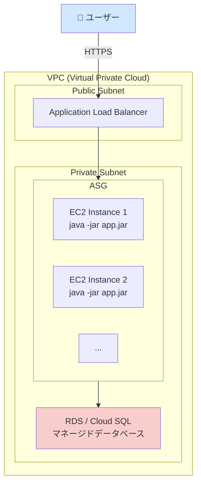
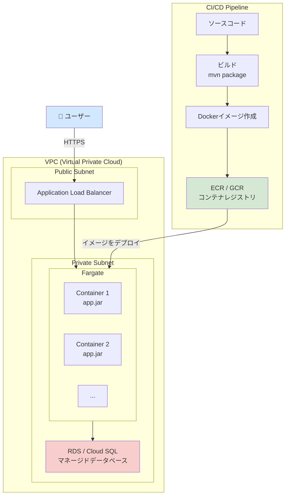
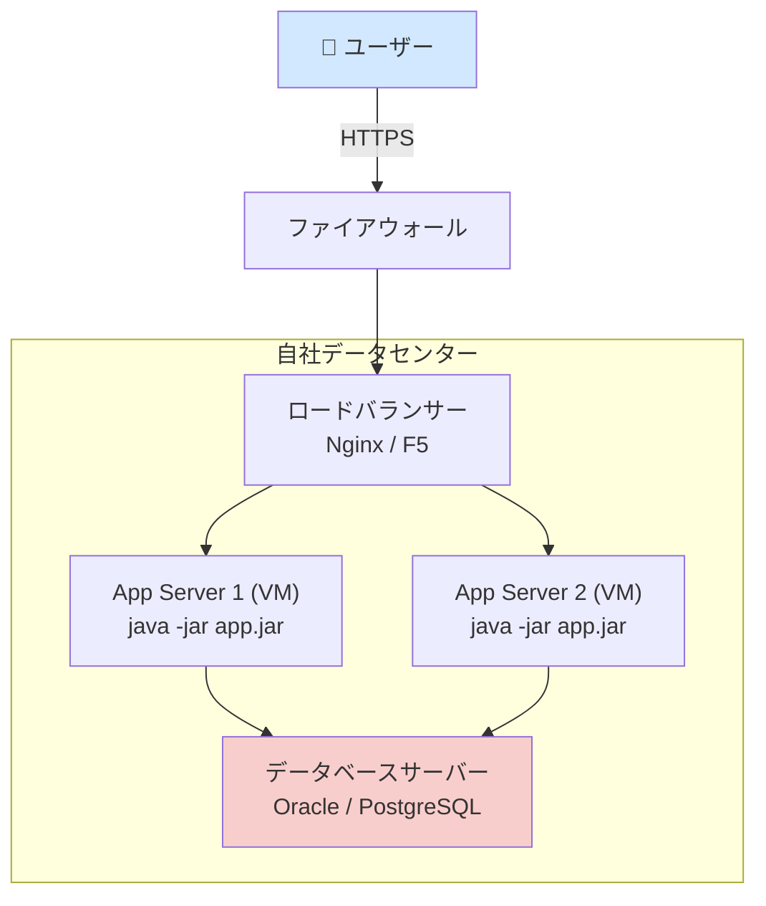

# デプロイ周り

## 前提：デプロイするものは何か？

Angular が「静的なファイルの集まり」だったのに対し、SpringBoot プロジェクトはビルドすると「Web サーバー（Tomcat）を内蔵した、単一で実行可能な JAR ファイル」になります。

`./mvnw package` を実行すると、`target/demo-0.0.1-SNAPSHOT.jar` のようなファイルが生成されます。 この JAR ファイルは、`java -jar demo-0.0.1-SNAPSHOT.jar` というコマンドだけで、Java がインストールされている環境ならどこでも起動し、API サーバーとして機能します。

この「自己完結した実行可能 JAR ファイル」という特性が、デプロイアーキテクチャを考える上での基本となります。

---

## 簡単な解説

### クラウドの場合

クラウドでは、この「実行可能 JAR ファイル」を動かすための、柔軟でスケーラブルな方法が多数提供されています。

- 仮想サーバーで動かす (IaaS): 一番シンプルなのは、仮想サーバー（AWS EC2 など）を 1 台借りて、そこで `java -jar ...` コマンドを実行する方法です。
- コンテナで動かす (CaaS): JAR ファイルを「コンテナ」という軽量な箱に入れ、それを管理するサービス（AWS Fargate, Google Cloud Run など）上で動かすのが現代的な主流です。アクセスが増えれば自動でコンテナの数を増やして対応できます。
- プラットフォームに任せる (PaaS): JAR ファイルをアップロードするだけで、あとはプラットフォーム（AWS Elastic Beanstalk, Heroku など）がサーバーの管理やスケーリングを自動でやってくれる、最も簡単な方法です。

### オンプレミスの場合

自社で管理するサーバー上で動かします。

- 物理/仮想サーバーで動かす: データセンターにある物理サーバーや、`VMware` などで構築した仮想サーバーに Java をインストールし、そこで `java -jar ...` コマンドを実行します。サーバーの OS 管理、セキュリティ、ネットワーク設定などをすべて自社で行う必要があります。

---

## 詳細な解説

ここからは、それぞれの構成でどのようなリソースが必要になるか、Mermaid 記法によるアーキテクチャ図を交えて詳しく解説します。

### 1. クラウドでのデプロイアーキテクチャ

**A) IaaS: 仮想サーバー (EC2) を利用した基本構成**

これは最も伝統的なクラウドの利用方法で、オンプレミスの構成に近いため理解しやすいです。

- 必要なリソース:

  - VPC (Virtual Private Cloud): クラウド上のプライベートなネットワーク空間。
  - EC2 インスタンス: JAR ファイルを実行する仮想サーバー。
  - ロードバランサー (ALB): 複数の EC2 インスタンスにトラフィックを分散させ、可用性を高める。
  - Auto Scaling Group: アクセス数に応じて EC2 インスタンスの数を自動で増減させる。
  - マネージドデータベース (RDS, Cloud SQL): データベースの運用管理をクラウドに任せる。
  - セキュリティグループ: EC2 インスタンスへのアクセスを制御するファイアウォール。

- アーキテクチャ図:

**B) CaaS: コンテナを利用したモダンな構成 (推奨)**

現在の主流であり、ポータビリティとスケーラビリティに最も優れた構成です。

- 必要なリソース:

  - Dockerfile: JAR ファイルをコンテナイメージに変換するための設計図。
  - コンテナレジストリ (ECR, GCR): 作成したコンテナイメージを保管する場所。
  - コンテナオーケストレーションサービス:
    - サーバーレス (推奨): AWS Fargate, Google Cloud Run, Azure Container Apps。サーバー管理が不要。
    - フル機能: Amazon EKS, Google GKE (Kubernetes)。より高度な制御が可能。
  - その他、ロードバランサーやデータベースは IaaS 構成と同様に利用します。

- アーキテクチャ図 (サーバーレスコンテナの場合):

### 2. オンプレミスでのデプロイアーキテクチャ

自社のデータセンター内でインフラを構築・管理します。

- 必要なリソース:

  - 物理サーバー: ラックマウントサーバーなど。
  - 仮想化基盤 (任意): VMware vSphere, KVM などで物理サーバー上に仮想マシン(VM)を作成。
  - ロードバランサー (ハードウェア/ソフトウェア): F5 Big-IP (ハードウェア) や、Nginx, HAProxy(ソフトウェア) など。
  - Java 実行環境: 各 VM に手動または構成管理ツール(Ansible など)でインストール。
  - データベースサーバー: Oracle, PostgreSQL などをインストールした専用サーバー。
  - ネットワーク機器: スイッチ、ルーター、ファイアウォール。

- アーキテクチャ図:

## まとめ

| 観点             | クラウド (コンテナ)            | クラウド (IaaS)            | オンプレミス                                   |
| :--------------- | :----------------------------- | :------------------------- | :--------------------------------------------- |
| 初期コスト       | 低 (従量課金)                  | 低 (従量課金)              | 非常に高い (ハードウェア購入費)                |
| 運用負荷         | 低い (サーバーレスの場合)      | 中 (OS のパッチ適用など)   | 非常に高い(ハードウェア、OS、ミドルウェア全て) |
| スケーラビリティ | 非常に高い (自動)              | 高い (自動)                | 限定的 (手動での増設)                          |
| デプロイ速度     | 速い (コンテナの起動)          | やや遅い (VM の起動)       | 遅い (手動での作業が多い)                      |
| おすすめのケース | ほとんどの新規アプリケーション | クラウドに移行する初期段階 | 厳しい規制や既存資産の都合がある場合           |

結論として、SpringBoot アプリケーションは自己完結しているため、コンテナとの相性が抜群です。特別な理由がない限り、クラウド上でコンテナサービスを利用してデプロイするのが、現代の開発において最も効率的でスケーラブルな選択肢と言えます。
