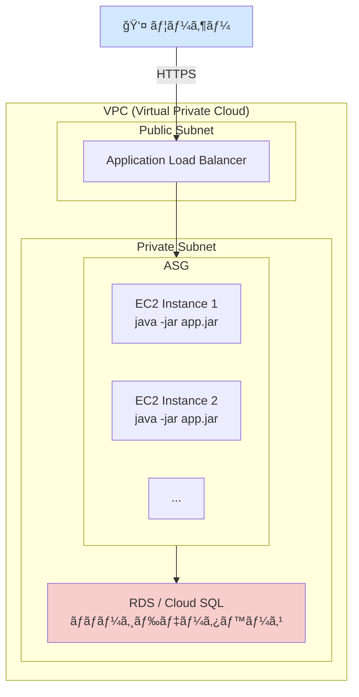
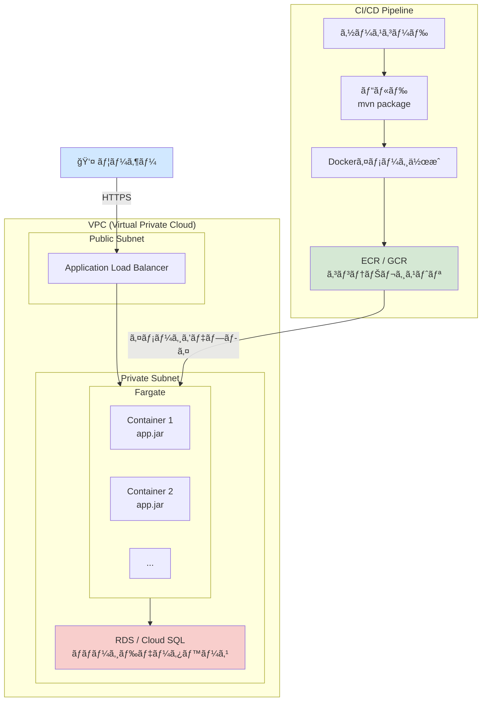
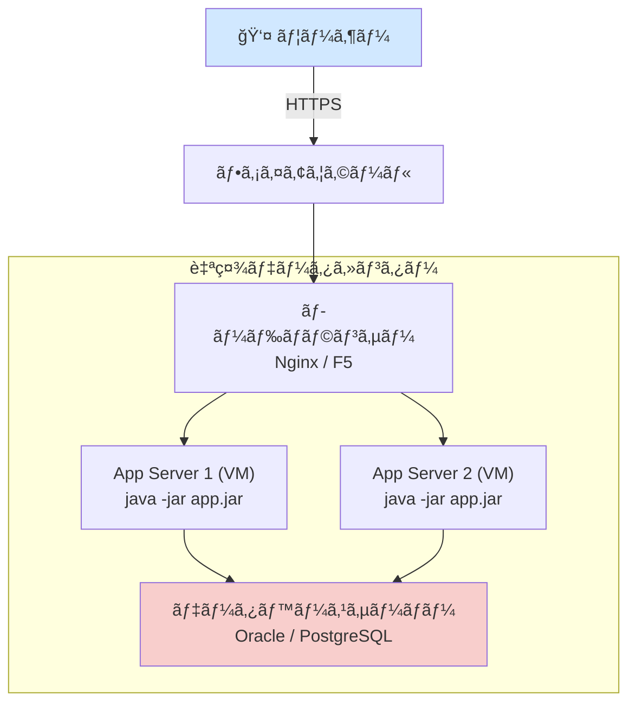

# デプロイ周り

## å‰æ：デプロイã™ã‚‹ã‚‚ã®ã¯ä½•ã‹ï¼Ÿ

Angular ãŒã€Œé™çš„ãªãƒ•ã‚¡ã‚¤ãƒ«ã®é›†ã¾ã‚Šã€ã ã£ãŸã®ã«å¯¾ã—ã€SpringBoot プロジェクトã¯ãƒ“ルドã™ã‚‹ã¨ã€ŒWeb サーãƒãƒ¼ï¼ˆTomcat）を内蔵ã—ãŸã€å˜ä¸€ã§å®Ÿè¡Œå¯èƒ½ãª JAR ファイルã€ã«ãªã‚Šã¾ã™ã€‚

`./mvnw package` を実行ã™ã‚‹ã¨ã€`target/demo-0.0.1-SNAPSHOT.jar` ã®ã‚ˆã†ãªãƒ•ã‚¡ã‚¤ãƒ«ãŒç”Ÿæˆã•ã‚Œã¾ã™ã€‚ ã“ã® JAR ファイルã¯ã€`java -jar demo-0.0.1-SNAPSHOT.jar` ã¨ã„ã†ã‚³ãƒãƒ³ãƒ‰ã ã‘ã§ã€Java ãŒã‚¤ãƒ³ã‚¹ãƒˆãƒ¼ãƒ«ã•ã‚Œã¦ã„る環境ãªã‚‰ã©ã“ã§ã‚‚èµ·å‹•ã—ã€API サーãƒãƒ¼ã¨ã—ã¦æ©Ÿèƒ½ã—ã¾ã™ã€‚

ã“ã®ã€Œè‡ªå·±å®Œçµã—ãŸå®Ÿè¡Œå¯èƒ½ JAR ファイルã€ã¨ã„ã†ç‰¹æ€§ãŒã€ãƒ‡ãƒ—ロイアーキテクãƒãƒ£ã‚’考ãˆã‚‹ä¸Šã§ã®åŸºæœ¬ã¨ãªã‚Šã¾ã™ã€‚

---

## ç°¡å˜ãªè§£èª¬

### クラウドã®å ´åˆ

クラウドã§ã¯ã€ã“ã®ã€Œå®Ÿè¡Œå¯èƒ½ JAR ファイルã€ã‚’å‹•ã‹ã™ãŸã‚ã®ã€æŸ”軟ã§ã‚¹ã‚±ãƒ¼ãƒ©ãƒ–ルãªæ–¹æ³•ãŒå¤šæ•°æä¾›ã•ã‚Œã¦ã„ã¾ã™ã€‚

- 仮想サーãƒãƒ¼ã§å‹•ã‹ã™ (IaaS): 一番シンプルãªã®ã¯ã€ä»®æƒ³ã‚µãƒ¼ãƒãƒ¼ï¼ˆAWS EC2 ãªã©ï¼‰ã‚’ 1 å°å€Ÿã‚Šã¦ã€ãã“㧠`java -jar ...` コãƒãƒ³ãƒ‰ã‚’実行ã™ã‚‹æ–¹æ³•ã§ã™ã€‚
- コンテナã§å‹•ã‹ã™ (CaaS): JAR ファイルを「コンテナã€ã¨ã„ã†è»½é‡ãªç®±ã«å…¥ã‚Œã€ãれを管ç†ã™ã‚‹ã‚µãƒ¼ãƒ“ス（AWS Fargate, Google Cloud Run ãªã©ï¼‰ä¸Šã§å‹•ã‹ã™ã®ãŒç¾ä»£çš„ãªä¸»æµã§ã™ã€‚アクセスãŒå¢—ãˆã‚Œã°è‡ªå‹•ã§ã‚³ãƒ³ãƒ†ãƒŠã®æ•°ã‚’増やã—ã¦å¯¾å¿œã§ãã¾ã™ã€‚
- プラットフォームã«ä»»ã›ã‚‹ (PaaS): JAR ファイルをアップロードã™ã‚‹ã ã‘ã§ã€ã‚ã¨ã¯ãƒ—ラットフォーム（AWS Elastic Beanstalk, Heroku ãªã©ï¼‰ãŒã‚µãƒ¼ãƒãƒ¼ã®ç®¡ç†ã‚„スケーリングを自動ã§ã‚„ã£ã¦ãれるã€æœ€ã‚‚ç°¡å˜ãªæ–¹æ³•ã§ã™ã€‚

### オンプレミスã®å ´åˆ

自社ã§ç®¡ç†ã™ã‚‹ã‚µãƒ¼ãƒãƒ¼ä¸Šã§å‹•ã‹ã—ã¾ã™ã€‚

- 物ç†/仮想サーãƒãƒ¼ã§å‹•ã‹ã™: データセンターã«ã‚る物ç†ã‚µãƒ¼ãƒãƒ¼ã‚„ã€`VMware` ãªã©ã§æ§‹ç¯‰ã—ãŸä»®æƒ³ã‚µãƒ¼ãƒãƒ¼ã« Java をインストールã—ã€ãã“㧠`java -jar ...` コãƒãƒ³ãƒ‰ã‚’実行ã—ã¾ã™ã€‚サーãƒãƒ¼ã® OS 管ç†ã€ã‚»ã‚­ãƒ¥ãƒªãƒ†ã‚£ã€ãƒãƒƒãƒˆãƒ¯ãƒ¼ã‚¯è¨­å®šãªã©ã‚’ã™ã¹ã¦è‡ªç¤¾ã§è¡Œã†å¿…è¦ãŒã‚ã‚Šã¾ã™ã€‚

---

## 詳細ãªè§£èª¬

ã“ã“ã‹ã‚‰ã¯ã€ãã‚Œãã‚Œã®æ§‹æˆã§ã©ã®ã‚ˆã†ãªãƒªã‚½ãƒ¼ã‚¹ãŒå¿…è¦ã«ãªã‚‹ã‹ã€Mermaid 記法ã«ã‚ˆã‚‹ã‚¢ãƒ¼ã‚­ãƒ†ã‚¯ãƒãƒ£å›³ã‚’交ãˆã¦è©³ã—ã解説ã—ã¾ã™ã€‚

### 1. クラウドã§ã®ãƒ‡ãƒ—ロイアーキテクãƒãƒ£

**A) IaaS: 仮想サーãƒãƒ¼ (EC2) を利用ã—ãŸåŸºæœ¬æ§‹æˆ**

ã“ã‚Œã¯æœ€ã‚‚ä¼çµ±çš„ãªã‚¯ãƒ©ã‚¦ãƒ‰ã®åˆ©ç”¨æ–¹æ³•ã§ã€ã‚ªãƒ³ãƒ—レミスã®æ§‹æˆã«è¿‘ã„ãŸã‚ç†è§£ã—ã‚„ã™ã„ã§ã™ã€‚

- å¿…è¦ãªãƒªã‚½ãƒ¼ã‚¹:

  - VPC (Virtual Private Cloud): クラウド上ã®ãƒ—ライベートãªãƒãƒƒãƒˆãƒ¯ãƒ¼ã‚¯ç©ºé–“。
  - EC2 インスタンス: JAR ファイルを実行ã™ã‚‹ä»®æƒ³ã‚µãƒ¼ãƒãƒ¼ã€‚
  - ロードãƒãƒ©ãƒ³ã‚µãƒ¼ (ALB): 複数㮠EC2 インスタンスã«ãƒˆãƒ©ãƒ•ã‚£ãƒƒã‚¯ã‚’分散ã•ã›ã€å¯ç”¨æ€§ã‚’高ã‚る。
  - Auto Scaling Group: アクセス数ã«å¿œã˜ã¦ EC2 インスタンスã®æ•°ã‚’自動ã§å¢—減ã•ã›ã‚‹ã€‚
  - ãƒãƒãƒ¼ã‚¸ãƒ‰ãƒ‡ãƒ¼ã‚¿ãƒ™ãƒ¼ã‚¹ (RDS, Cloud SQL): データベースã®é‹ç”¨ç®¡ç†ã‚’クラウドã«ä»»ã›ã‚‹ã€‚
  - セキュリティグループ: EC2 インスタンスã¸ã®ã‚¢ã‚¯ã‚»ã‚¹ã‚’制御ã™ã‚‹ãƒ•ã‚¡ã‚¤ã‚¢ã‚¦ã‚©ãƒ¼ãƒ«ã€‚

- アーキテクãƒãƒ£å›³:

```mermaid
graph TD
  User[👤 ユーザー] -->|HTTPS| LB["Application Load Balancer"]

  subgraph "VPC (Virtual Private Cloud)"
    subgraph "Public Subnet"
      LB
    end

    subgraph "Private Subnet"
      ASG["Auto Scaling Group"]
      DB["RDS / Cloud SQL<br>ãƒãƒãƒ¼ã‚¸ãƒ‰ãƒ‡ãƒ¼ã‚¿ãƒ™ãƒ¼ã‚¹"]
    end

    ASG --> DB
    LB --> ASG
  end

  subgraph ASG
    direction LR
    EC2_1["EC2 Instance 1<br>java -jar app.jar"]
    EC2_2["EC2 Instance 2<br>java -jar app.jar"]
    EC2_3["..."]
  end

  style User fill:#D1E8FF
  style DB fill:#F8CECC
```

**B) CaaS: コンテナを利用ã—ãŸãƒ¢ãƒ€ãƒ³ãªæ§‹æˆ (æ¨å¥¨)**

ç¾åœ¨ã®ä¸»æµã§ã‚ã‚Šã€ãƒãƒ¼ã‚¿ãƒ“リティã¨ã‚¹ã‚±ãƒ¼ãƒ©ãƒ“リティã«æœ€ã‚‚優れãŸæ§‹æˆã§ã™ã€‚

- å¿…è¦ãªãƒªã‚½ãƒ¼ã‚¹:

  - Dockerfile: JAR ファイルをコンテナイメージã«å¤‰æ›ã™ã‚‹ãŸã‚ã®è¨­è¨ˆå›³ã€‚
  - コンテナレジストリ (ECR, GCR): 作æˆã—ãŸã‚³ãƒ³ãƒ†ãƒŠã‚¤ãƒ¡ãƒ¼ã‚¸ã‚’ä¿ç®¡ã™ã‚‹å ´æ‰€ã€‚
  - コンテナオーケストレーションサービス:
    - サーãƒãƒ¼ãƒ¬ã‚¹ (æ¨å¥¨): AWS Fargate, Google Cloud Run, Azure Container Apps。サーãƒãƒ¼ç®¡ç†ãŒä¸è¦ã€‚
    - フル機能: Amazon EKS, Google GKE (Kubernetes)。より高度ãªåˆ¶å¾¡ãŒå¯èƒ½ã€‚
  - ãã®ä»–ã€ãƒ­ãƒ¼ãƒ‰ãƒãƒ©ãƒ³ã‚µãƒ¼ã‚„データベース㯠IaaS 構æˆã¨åŒæ§˜ã«åˆ©ç”¨ã—ã¾ã™ã€‚

- アーキテクãƒãƒ£å›³ (サーãƒãƒ¼ãƒ¬ã‚¹ã‚³ãƒ³ãƒ†ãƒŠã®å ´åˆ):

```mermaid
graph TD
  User[👤 ユーザー] -->|HTTPS| LB["Application Load Balancer"]

  subgraph "VPC (Virtual Private Cloud)"
    subgraph "Public Subnet"
      LB
    end

    subgraph "Private Subnet"
      Fargate["**Fargate / Cloud Run Service**<br>コンテナオーケストレーション"]
      DB["RDS / Cloud SQL<br>ãƒãƒãƒ¼ã‚¸ãƒ‰ãƒ‡ãƒ¼ã‚¿ãƒ™ãƒ¼ã‚¹"]
    end

    Fargate --> DB
    LB --> Fargate
  end

  subgraph Fargate
    direction LR
    Container1["Container 1<br>app.jar"]
    Container2["Container 2<br>app.jar"]
    Container3["..."]
  end

  subgraph "CI/CD Pipeline"
    direction LR
    Code["ソースコード"] --> Build["ビルド<br>mvn package"] --> Dockerize["Dockerイメージ作æˆ"]
    Dockerize --> Registry["ECR / GCR<br>コンテナレジストリ"]
  end

  Registry -- "イメージをデプロイ" --> Fargate

  style User fill:#D1E8FF
  style DB fill:#F8CECC
  style Registry fill:#D5E8D4
```

### 2. オンプレミスã§ã®ãƒ‡ãƒ—ロイアーキテクãƒãƒ£

自社ã®ãƒ‡ãƒ¼ã‚¿ã‚»ãƒ³ã‚¿ãƒ¼å†…ã§ã‚¤ãƒ³ãƒ•ãƒ©ã‚’構築・管ç†ã—ã¾ã™ã€‚

- å¿…è¦ãªãƒªã‚½ãƒ¼ã‚¹:

  - 物ç†ã‚µãƒ¼ãƒãƒ¼: ラックãƒã‚¦ãƒ³ãƒˆã‚µãƒ¼ãƒãƒ¼ãªã©ã€‚
  - 仮想化基盤 (ä»»æ„): VMware vSphere, KVM ãªã©ã§ç‰©ç†ã‚µãƒ¼ãƒãƒ¼ä¸Šã«ä»®æƒ³ãƒã‚·ãƒ³(VM)を作æˆã€‚
  - ロードãƒãƒ©ãƒ³ã‚µãƒ¼ (ãƒãƒ¼ãƒ‰ã‚¦ã‚§ã‚¢/ソフトウェア): F5 Big-IP (ãƒãƒ¼ãƒ‰ã‚¦ã‚§ã‚¢) ã‚„ã€Nginx, HAProxy(ソフトウェア) ãªã©ã€‚
  - Java 実行環境: å„ VM ã«æ‰‹å‹•ã¾ãŸã¯æ§‹æˆç®¡ç†ãƒ„ール(Ansible ãªã©)ã§ã‚¤ãƒ³ã‚¹ãƒˆãƒ¼ãƒ«ã€‚
  - データベースサーãƒãƒ¼: Oracle, PostgreSQL ãªã©ã‚’インストールã—ãŸå°‚用サーãƒãƒ¼ã€‚
  - ãƒãƒƒãƒˆãƒ¯ãƒ¼ã‚¯æ©Ÿå™¨: スイッãƒã€ãƒ«ãƒ¼ã‚¿ãƒ¼ã€ãƒ•ã‚¡ã‚¤ã‚¢ã‚¦ã‚©ãƒ¼ãƒ«ã€‚

- アーキテクãƒãƒ£å›³:

```mermaid
graph TD
  User[👤 ユーザー] -->|HTTPS| Firewall["ファイアウォール"]
  Firewall --> LB["ロードãƒãƒ©ãƒ³ã‚µãƒ¼<br>Nginx / F5"]

  subgraph "自社データセンター"
    LB --> AppServer1["App Server 1 (VM)<br>java -jar app.jar"]
    LB --> AppServer2["App Server 2 (VM)<br>java -jar app.jar"]

    AppServer1 --> DBServer["データベースサーãƒãƒ¼<br>Oracle / PostgreSQL"]
    AppServer2 --> DBServer
  end

  style User fill:#D1E8FF
  style DBServer fill:#F8CECC
```

## ã¾ã¨ã‚

| 観点             | クラウド (コンテナ)            | クラウド (IaaS)            | オンプレミス                                   |
| :--------------- | :----------------------------- | :------------------------- | :--------------------------------------------- |
| åˆæœŸã‚³ã‚¹ãƒˆ       | ä½ (従é‡èª²é‡‘)                  | ä½ (従é‡èª²é‡‘)              | é常ã«é«˜ã„ (ãƒãƒ¼ãƒ‰ã‚¦ã‚§ã‚¢è³¼å…¥è²»)                |
| é‹ç”¨è² è·         | ä½ã„ (サーãƒãƒ¼ãƒ¬ã‚¹ã®å ´åˆ)      | 中 (OS ã®ãƒ‘ッãƒé©ç”¨ãªã©)   | é常ã«é«˜ã„(ãƒãƒ¼ãƒ‰ã‚¦ã‚§ã‚¢ã€OSã€ãƒŸãƒ‰ãƒ«ã‚¦ã‚§ã‚¢å…¨ã¦) |
| スケーラビリティ | é常ã«é«˜ã„ (自動)              | 高ㄠ(自動)                | é™å®šçš„ (手動ã§ã®å¢—設)                          |
| デプロイ速度     | 速ㄠ(コンテナã®èµ·å‹•)          | ã‚„ã‚„é…ã„ (VM ã®èµ·å‹•)       | é…ã„ (手動ã§ã®ä½œæ¥­ãŒå¤šã„)                      |
| ãŠã™ã™ã‚ã®ã‚±ãƒ¼ã‚¹ | ã»ã¨ã‚“ã©ã®æ–°è¦ã‚¢ãƒ—リケーション | クラウドã«ç§»è¡Œã™ã‚‹åˆæœŸæ®µéš | å³ã—ã„è¦åˆ¶ã‚„既存資産ã®éƒ½åˆãŒã‚ã‚‹å ´åˆ           |

çµè«–ã¨ã—ã¦ã€SpringBoot アプリケーションã¯è‡ªå·±å®Œçµã—ã¦ã„ã‚‹ãŸã‚ã€ã‚³ãƒ³ãƒ†ãƒŠã¨ã®ç›¸æ€§ãŒæŠœç¾¤ã§ã™ã€‚特別ãªç†ç”±ãŒãªã„é™ã‚Šã€ã‚¯ãƒ©ã‚¦ãƒ‰ä¸Šã§ã‚³ãƒ³ãƒ†ãƒŠã‚µãƒ¼ãƒ“スを利用ã—ã¦ãƒ‡ãƒ—ロイã™ã‚‹ã®ãŒã€ç¾ä»£ã®é–‹ç™ºã«ãŠã„ã¦æœ€ã‚‚効ç‡çš„ã§ã‚¹ã‚±ãƒ¼ãƒ©ãƒ–ルãªé¸æŠè‚¢ã¨è¨€ãˆã¾ã™ã€‚
