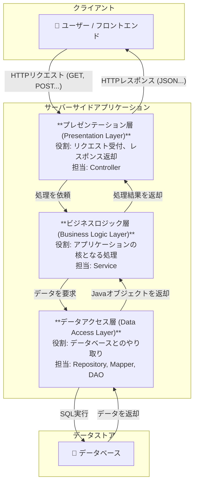

# 改装型アーキテクチャ

Java の（特に Spring を使った）開発において、「〇〇層」という言葉で表される階層型アーキテクチャ（Layered Architecture）の考え方は、アプリケーションをクリーンで保守しやすく保つための基本中の基本となります。

このアーキテクチャの最大の目的は、「関心の分離（Separation of Concerns）」です。つまり、アプリケーションの各部分が持つ「責任」や「役割」を明確に分割し、それぞれの部分が自分の仕事にだけ集中できるようにすることです。

## なぜ層に分けるのか？

レストランを想像してみてください。

- ウェイターは、客から注文を受け取り、厨房に伝え、出来上がった料理を運びます。
- シェフは、注文に従ってレシピ（ビジネスロジック）を元に料理を作ります。
- 食材調達係は、倉庫（データベース）から必要な食材を取り出してきます。

もし一人の人間がこれら全てをやろうとしたら、非常に非効率でミスも増えますよね？アプリケーションも同じで、役割を分けることで、各層は独立して開発・テスト・修正がしやすくなります。

## 一般的な 3 層アーキテクチャ

Java の Web アプリケーションで最も一般的に見られるのは、以下の 3 つの層（レイヤー）から成る構成です。

---

## 各層の詳細な役割

### 1. プレゼンテーション層 (Presentation Layer)

- 別名: コントローラー層、Web 層
- 役割: アプリケーションの「玄関」「窓口」です。外部（ユーザーのブラウザや他のシステム）からの HTTP リクエストを直接受け取ります。
  - リクエストの URL と HTTP メソッドを見て、どの処理を呼び出すかを判断する。
  - リクエストに含まれるデータ（JSON など）を Java オブジェクトに変換する。
  - 基本的な入力値のチェック（例：必須項目があるか）。
  - ビジネスロジック層（Service）に必要な処理を依頼する。
  - Service から返ってきた処理結果を、クライアントが受け取れる形式（JSON など）に変換して HTTP レスポンスとして返す。
- やってはいけないこと: 複雑な業務ロジックの実装、データベースへの直接アクセス。
- レストランの例え: ウェイター
- Spring での主な担当クラス: `@RestController`, `@Controller`

### 2. ビジネスロジック層 (Business Logic Layer)

- 別名: サービス層 (Service Layer)
- 役割: アプリケーションの「頭脳」です。このアプリケーションが一体何をするためのものなのか、その核となるルールや処理を実装します。
  - 複数のデータアクセス処理を組み合わせて、一つの意味のある業務処理（ユースケース）を完成させる。（例：「注文を受け付けたら、在庫を減らし、発送履歴を記録する」）
  - 複雑な計算や、業務上のルールに基づいた判断を行う。
  - トランザクション管理（複数のデータベース更新を、すべて成功かすべて失敗のどちらかに保証する仕組み）を行う。
- やってはいけないこと: HTTP リクエストやレスポンスの詳細を知ること（`HttpServletRequest` などを直接扱わない）。
- レストランの例え: シェフ
- Spring での主な担当クラス: `@Service`

### 3. データアクセス層 (Data Access Layer)

- 別名: 永続化層 (Persistence Layer)、リポジトリ層 (Repository Layer)、DAO 層 (Data Access Object Layer)
- 役割: データベースや外部 API といった、データの保管場所との「唯一の接点」です。データの読み書き（CRUD: Create, Read, Update, Delete）に特化します。
  - Service 層からの依頼に基づき、SQL を実行してデータベースを操作する。
  - データベースから取得したデータを、Java オブジェクトにマッピングして Service 層に返す。
- やってはいけないこと:
  ビジネスロジックを持つこと。（例：「ユーザーが管理者権限を持っているか？」といった判断は Service 層の仕事）
- レストランの例え: 食材調達係
- Spring での主な担当クラス: `@Repository` (JPA)、`@Mapper` (MyBatis)、または DAO という名前のクラス

**なぜこの分離が重要なのか？**

- テストのしやすさ: 各層を独立してテストできます。例えば、`Controller` をテストする際は、`Service` 層を偽物（モック）に置き換えることで、データベース接続なしに高速なテストが可能です。
- 保守性・可読性の向上: 「API の URL を変えたい」なら `Controller` を、「料金計算のロジックを変えたい」なら `Service` を、「DB を Oracle から PostgreSQL に変えたい」なら `DataAccess` 層を…というように、変更箇所が特定しやすくなります。
- 柔軟性と再利用性: 例えば、同じビジネスロジックを Web 画面だけでなく、スマホアプリやバッチ処理からも使いたい場合、`Service` 層のコードを再利用できます。プレゼンテーション層を複数用意するだけで対応できるのです。
