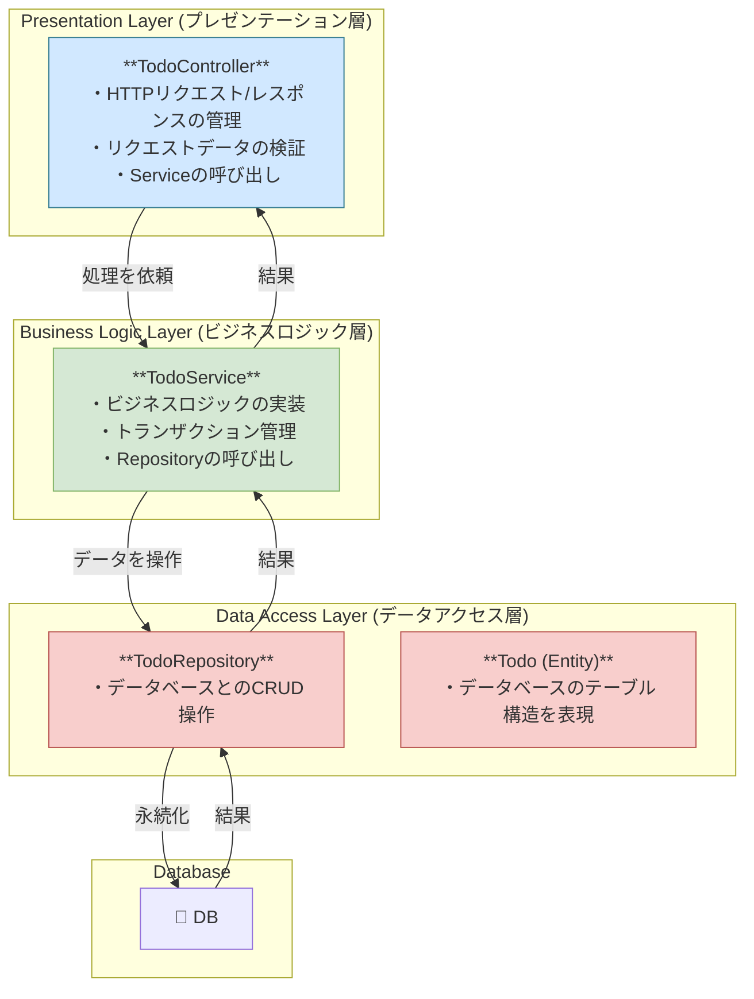

# Service 層と Repository 層の役割分担

現在の TODO アプリでは、Controller が直接 Repository を呼び出してデータベースを操作しています。これは小規模なアプリケーションでは問題ありませんが、アプリケーションが成長するにつれて、コードの見通しが悪くなり、保守が困難になるという問題を引き起こします。

そこで登場するのが、Service 層です。Controller と Repository の間に Service という層を設けることで、よりクリーンで拡張性の高い設計（レイヤードアーキテクチャ）を実現できます。

それでは、Repository の役割から解説し、なぜ Service 層が必要なのかを明らかにしていきましょう。

## Repository 層の役割：データ永続化の担当者

まず、Controller で使われていた TodoRepository のコードを見てみましょう。

✦ この TodoRepository はインターフェースであり、中身が空っぽなのに気づきましたか？
これが Spring Data JPA の強力な機能です。

- `JpaRepository<Todo, Long>` を継承するだけで、Spring Data JPA が実行時に自動的に実装クラスを生成してくれます。
- この実装クラスには、基本的な CRUD（Create, Read, Update, Delete）操作を行うためのメソッドがすべて含まれています。
  - `save(Todo entity)`: 新規保存または更新
  - `findById(Long id)`: ID による一件検索
  - `findAll()`: 全件検索
  - `deleteById(Long id)`: ID による削除
  - など多数...
- Repository の責務は、データベースとのやり取り（永続化）に特化することです。ビジネスロジック（業務上のルールや計算）はここには含めません。

## Service 層の役割：ビジネスロジックの担当者

では、なぜ Controller と Repository の間に Service 層を挟むのでしょうか？

`Service`層の主な責務は、アプリケーションの **「ビジネスロジック」** を実装することです。

ビジネスロジックとは、例えば以下のような処理です。

- 複数の Repository を組み合わせて、より複雑なデータ操作を行う。
  - 例：「ユーザーが退会したら、そのユーザーの TODO もすべて削除する」
- データの妥当性チェック（バリデーション）を行う。
  - 例：「TODO のタイトルは空であってはならない」
- 外部の API を呼び出す。
  - 例：「TODO が作成されたら、Slack に通知を送る」
- トランザクション管理を行う。
  - 複数のデータベース操作を「すべて成功」か「すべて失敗」のどちらかにまとめる（原子性を保証する）処理です。

**もし Service 層がないと...**

`TodoController` に、以下のようなビジネスロジックを追加することを想像してみてください。

- TODO を追加する際、タイトルが重複していたらエラーを返す。
- TODO を更新する際、完了済みの TODO は更新できないようにする。
- TODO を削除する際、操作ログを記録する。

これらのロジックをすべて Controller に書くと、Controller はどんどん肥大化し、本来の責務である「HTTP リクエストとレスポンスの管理」から逸脱してしまいます。コードの可読性が下がり、テストも複雑になります。

## Service 層を導入したアーキテクチャ

理想的なレイヤードアーキテクチャは以下のようになります。



## 具体的な実装イメージ

1. `TodoService`クラスを作成する

```java
@Service // このクラスがService層のコンポーネントであることを示す
public class TodoService {

    @Autowired
    private TodoRepository todoRepository;

    // ビジネスロジックをここに実装する
    public List<Todo> findAllTodos() {
        return todoRepository.findAll();
    }

    public Todo createTodo(Todo todo) {
        // 例: タイトルが空なら例外を投げるバリデーション
        if (todo.getTitle() == null || todo.getTitle().isEmpty()) {
            throw new IllegalArgumentException("Title cannot be empty.");
        }
        return todoRepository.save(todo);
    }

    // 他のメソッド...
}
```

2. `TodoController`を修正する

```java
@RestController
@RequestMapping("/api/todos")
public class TodoController {

    @Autowired
    private TodoService todoService; // Repositoryの代わりにServiceを注入

    @GetMapping
    public List<Todo> getAllTodos() {
        return this.todoService.findAllTodos(); // Serviceのメソッドを呼び出す
    }

    @PostMapping
    public ResponseEntity<Todo> createTodo(@RequestBody Todo todo) {
        Todo saved = todoService.createTodo(todo); // Serviceのメソッドを呼び出す
        return ResponseEntity.ok(saved);
    }

    // 他のメソッドも同様に修正...
}
```

まとめ

- `Controller`: HTTP の世界との窓口。リクエストを受け取り、レスポンスを返すことに専念する。
- `Service`: アプリケーションの核となるビジネスロジックを担当する。複数の Repository を扱うこともある。
- `Repository`: データベースとのやり取りに専念する。

この関心の分離 (Separation of Concerns)を行うことで、各クラスの責務が明確になり、コードの再利用性、保守性、テストのしやすさが格段に向上します。
