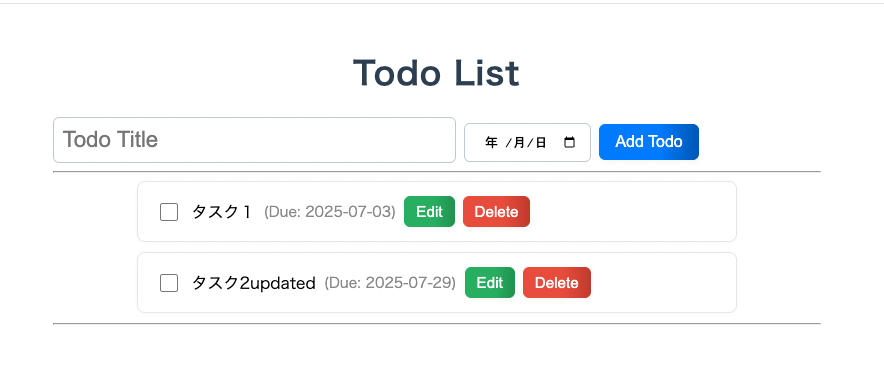

# TODO アプリケーション開発ドキュメント

## 概要

このドキュメントは、Angular と Spring Boot を使用して開発した TODO アプリケーションの技術的な詳細と学習内容をまとめたものです。

追記:
**Spring Data JPA から MyBatis へ移行**した

## 技術スタック

### フロントエンド

- **フレームワーク:** Angular (^19.2.0)
- **言語:** TypeScript
- **パッケージ管理:** npm
- **主なライブラリ:**
  - RxJS: 非同期処理とイベントベースのプログラミングに使用
  - zone.js: Angular の変更検知を効率化

### バックエンド

- **フレームワーク:** Spring Boot (3.5.3)
- **言語:** Java (17)
- **ビルドツール:** Maven
- **主なライブラリ:**
  - **Spring Web:** RESTful API を構築するために使用
  - ~~**Spring Data JPA:** データベースアクセスのための永続化 API~~
  - 追記: **データマッパー:** **MyBatis** (↑ JPA から変更)
  - **H2 Database:** 開発用のインメモリデータベース
  - **Jackson:** Java オブジェクトと JSON の相互変換

## 主な機能

- **TODO 一覧表示:** 登録されている TODO を一覧で表示します。
- **TODO 追加:** 新しい TODO を登録します。
- **TODO 削除:** 既存の TODO を削除します。
- **TODO 更新:** TODO の完了状態を更新します。

## API エンドポイント

| メソッド | パス              | 説明                         |
| -------- | ----------------- | ---------------------------- |
| `GET`    | `/api/todos`      | 全ての TODO を取得           |
| `POST`   | `/api/todos`      | 新しい TODO を作成           |
| `PUT`    | `/api/todos/{id}` | 指定された ID の TODO を更新 |
| `DELETE` | `/api/todos/{id}` | 指定された ID の TODO を削除 |

## 起動方法

### 1. バックエンドの起動

1.  ターミナルを開き、`backend`ディレクトリに移動します。
    ```bash
    cd backend
    ```
2.  以下のコマンドを実行して、Spring Boot アプリケーションを起動します。
    ```bash
    ./mvnw spring-boot:run
    ```
    これにより、`http://localhost:8080`でバックエンドサーバーが起動します。

### 2. フロントエンドの起動

1.  別のターミナルを開き、`frontend`ディレクトリに移動します。
    ```bash
    cd frontend
    ```
2.  以下のコマンドを実行して、Angular 開発サーバーを起動します。
    ```bash
    npm start
    ```
    これにより、`http://localhost:4200`でフロントエンドアプリケーションが起動します。アプリケーションは自動的にブラウザで開かれます。



## メモ

- **CORS (Cross-Origin Resource Sharing) 対応:**
  - 開発環境では、フロントエンド(`localhost:4200`)とバックエンド(`localhost:8080`)のオリジンが異なるため、CORS エラーが発生
  - Angular のプロキシ機能 (`proxy.conf.json`) を利用して、`/api`へのリクエストをバックエンドサーバーに転送することで、この問題を解決
- **Angular と Spring Boot の連携:**
  - Angular の`HttpClient`を使用して、Spring Boot が提供する REST API との間で HTTP リクエスト（GET, POST, PUT, DELETE）を送受信
  - `Observable`を`subscribe`することで、非同期な API レスポンスを処理
- **REST API の設計と実装:**
  - Spring Boot を使い、`@RestController`, `@GetMapping`, `@PostMapping`, `@PutMapping`, `@DeleteMapping`といったアノテーションを利用して、RESTful な API を実装
- **サービスの役割:**
  - HTTP 通信などのビジネスロジックをコンポーネントから分離し、再利用可能な「サービス」として実装できました。
- **エンティティ作成とは？**
  - データベースのテーブル（表）に対応する Java のクラス（設計図）のこと
  - 「データベースのテーブル」と「Java のクラス」を紐付ける（マッピングする）のがエンティティの役割
- **getter と setter とは？**
  - 「getter（ゲッター）」と「setter（セッター）」は、Java などのオブジェクト指向プログラミングにおいて、クラスの内部にあるデータ（フィールドやプロパティと呼ばれる変数）にアクセスしたり、そのデータを変更したりするための特別なメソッド
  - オブジェクト指向プログラミングにおける「カプセル化（Encapsulation）」の原則の考え方
    - クラスの内部状態（データ）を外部から直接触らせない
    - データの操作は、そのクラス自身が提供するメソッドを通じてのみ行う
  - **Getter とは？**
    - 役割: クラスのプライベートなフィールドの値を取得するためのメソッド
    - 命名規則: 通常、get の後ろにフィールド名をつける（例: `getTitle()`。boolean 型のフィールドの場合は is を使うこともある（例: `isCompleted()`）
  - **Setter とは？**
    - 役割: クラスのプライベートなフィールドの値を設定する（変更する）ためのメソッド
    - 命名規則: 通常、set の後ろにフィールド名をつづける（例: `setTitle(String newTitle)`）

## 追記: JPA から MyBatis への移行による変更点と学び

今回の改修の目的は、SQL をより直接的にコントロールできる MyBatis への理解を深めることでした。以下に主要な変更点と、そこから得られた学びをまとめます。

### 1. 依存関係の変更 (`pom.xml`)

- **削除** `spring-boot-starter-data-jpa` の依存関係を削除した
- **追加** `mybatis-spring-boot-starter` の依存関係を追加
- **学び** プロジェクトのデータアクセス技術を切り替える際は、まず `pom.xml` で部品を入れ替えることが第一段階

### 2. データアクセス層の実装変更

- **`Repository` から `Mapper` へ:**
  - Spring Data JPA の `JpaRespository` インターフェースを削除
  - 代わりに `@Mapper` アノテーションをつけた `TodoMapper` インターフェースを作成
- **SQL の明示的な記述:**
  - `JpaRepository` がメソッド名から自動生成していた SQL を、`@Select`、`@Insert`, `@Update`, `@Delete` アノテーションを使って `TodoMapper` 内に直接記述した
- **学び:**
  - MyBatis では、実行される SQL を開発者が完全に制御できる
  - これにより、複雑なクエリやチューニングが必要な時に対応できる

### 3. テーブルスキーマの管理 (`schema.sql`)

- JPA の `ddl-auto` 機能（エンティティからのテーブル自動生成）が使えなくなったため、`src/main/resources/` に `schema.sql` ファイルを作成
- このファイルに `CREATE TABLE` 文を記述することで、アプリ起動時に H2 データベース上にテーブルが作成されるようになる
- **学び:**
  - データアクセス層の技術によっては、DB スキーマの管理方法も変わることを理解した

### 4. 命名規則の不一致対応 (`application.properties`)

- **問題:** Java のプロパティ名（例: `dueDate`）と DB のカラム名（例: `due_date`）の命名規則の違い（キャメルケース vs スネークケース）により、`dueDate` が `null` で登録されるバグが発生
- **解決策:** `application.properties` に `mybatis.configuration.map-underscore-to-camel-case=true` を追加した
- **学び:** この設定により、MyBatis が命名規則の違いを吸収し、自動でマッピングしてくれることを学んだ

### 5. テストコードの修正 (`TodoControllerTest.java`)

- `@MockBean` の対象を `TodoRepository` から `TodoMapper` に変更
- Mapper の `save`/`update` メソッドは戻り値が `void` のため、Mockito の `when(...).thenReturn(...)` が使えなくなった
- 代わりに `doAnswer(...)` や `doNothing()` を使い、「メソッドが呼ばれた際の振る舞い」を定義する方法でテストを修正した
- **学び:** 依存するコンポーネントの仕様が変われば、それをモックするテストコードの書き方も変える必要があることを学んだ
